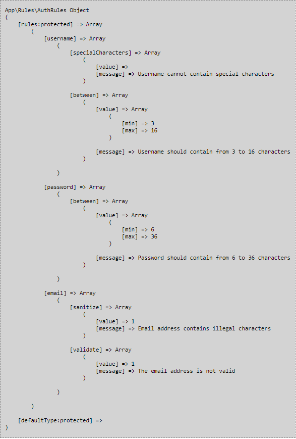

# PHP Start
The project is a complete file package to create applications in PHP technology.

## Build with
1. PHP 7.4

## Features
1. Registration / Login
2. Password recovery
3. User profile management (username / photo / password)

## Installation Instructions
1. Run `git clone https://github.com/dawidbros1/php-start.git`
2. Run `componser install`
3. Create a MySQL database for the project
4. From the project root folder run `cd .\config\` and next `rename config_dist.php config.php`
5. Configure your `./config/config.php` file
6. Import tables from file `./sql/database.sql` to your database

## Tree directory
   - [composer.json](composer.json)
   - [composer.lock](composer.lock)
   - __config__
     - [config\_dist.php](config/config_dist.php)
   - [index.php](index.php)
   - __public__
     - __css__
       - [contact.css](public/css/contact.css)
       - [profile.css](public/css/profile.css)
       - [style.css](public/css/style.css)
     - __images__
       - __SocialMedia__
         - [facebook.png](public/images/SocialMedia/facebook.png)
         - [instagram.png](public/images/SocialMedia/instagram.png)
         - [linkedin.png](public/images/SocialMedia/linkedin.png)
         - [twitter.png](public/images/SocialMedia/twitter.png)
         - [youtube.png](public/images/SocialMedia/youtube.png)
       - [avatar.png](public/images/avatar.png)
     - __js__
       - [main.js](public/js/main.js)
   - [recaptchalib.php](recaptchalib.php)
   - __routes__
     - [routes.php](routes/routes.php)
   - __sql__
     - [database.sql](sql/database.sql)
   - __src__
     - [Component.php](src/Component.php)
     - __Controller__
       - [AuthController.php](src/Controller/AuthController.php)
       - [Controller.php](src/Controller/Controller.php)
       - [GeneralController.php](src/Controller/GeneralController.php)
       - [UserController.php](src/Controller/UserController.php)
     - __Exception__
       - [AppException.php](src/Exception/AppException.php)
       - [ConfigurationException.php](src/Exception/ConfigurationException.php)
       - [NotFoundException.php](src/Exception/NotFoundException.php)
       - [StorageException.php](src/Exception/StorageException.php)
     - __Helper__
       - [Request.php](src/Helper/Request.php)
       - [Session.php](src/Helper/Session.php)
     - __Model__
       - [Auth.php](src/Model/Auth.php)
       - [Config.php](src/Model/Config.php)
       - [Mail.php](src/Model/Mail.php)
       - [Model.php](src/Model/Model.php)
       - [Route.php](src/Model/Route.php)
       - [Rules.php](src/Model/Rules.php)
       - [User.php](src/Model/User.php)
     - __Repository__
       - [AuthRepository.php](src/Repository/AuthRepository.php)
       - [Repository.php](src/Repository/Repository.php)
       - [UserRepository.php](src/Repository/UserRepository.php)
     - __Rules__
       - [AuthRules.php](src/Rules/AuthRules.php)
       - [UserRules.php](src/Rules/UserRules.php)
     - __Utils__
       - [debug.php](src/Utils/debug.php)
     - __Validator__
       - [Validator.php](src/Validator/Validator.php)
     - [View.php](src/View.php)
   - __templates__
     - __auth__
       - [forgotPassword.php](templates/auth/forgotPassword.php)
       - [login.php](templates/auth/login.php)
       - [register.php](templates/auth/register.php)
       - [resetPassword.php](templates/auth/resetPassword.php)
     - __component__
       - __button__
         - [back.php](templates/component/button/back.php)
       - [error.php](templates/component/error.php)
       - __form__
         - [button.php](templates/component/form/button.php)
         - [input.php](templates/component/form/input.php)
     - __general__
       - [contact.php](templates/general/contact.php)
       - [home.php](templates/general/home.php)
       - [policy.php](templates/general/policy.php)
       - [regulations.php](templates/general/regulations.php)
     - __layout__
       - [main.php](templates/layout/main.php)
     - [messages.php](templates/messages.php)
     - __user__
       - [profile.php](templates/user/profile.php)
   - __uploads__
     - __images__
       - __avatar__

## Table of contents
- [Routing](#routing)
  - [How create new routing](#how-create-new-routing)
  - [How use routing](#how-use-routing)
- [Routes](#routes)
- [Rules](#rules)
  - [How to create new rule](#how-to-create-new-rule)
  - [Available methods](#available-methods)
  - [How use getType() and getRule()](#how-use-gettype-and-getrule)
- [Controllers](#controllers)
  - [Controller](#controller)
  - [AuthController](#authcontroller)
  - [UserController](#usercontroller)
  - [GeneralController](#generalcontroller)
  - [How to create new controller](#how-to-create-new-controller)
- [Models](#models)
  - [Model](#model)
  - [Auth](#auth)
  - [User](#user)
- [Repositories](#repositories)
  - [Repository](#repository)
  - [AuthRepository](#authrepository)
  - [UserRepository](#userrepository)
  - [How to create new repository](#how-to-create-new-repository)
- [Validator](#validator)
  - [Available methods to validate data](#available-methods-to-validate-data)
  - [Available methods to validate images](#available-methods-to-validate-images)
  - [How validate data](#how-validate-data)
- [Helpers](#helpers)
  - [Session](#session)
  - [Request](#request)
- [Components](#component)
- [View](#view)

## Routing
### How create new routing
Register a new group in `routes/routes.php`
```
$route->group('', ['home', 'policy', 'contact', 'regulations']);
$route->group('auth', ['register', 'login', 'forgotPassword', 'resetPassword']);
$route->group('user', ['logout', 'profile', 'update']);
```

### How use routing
```
$this->redirect(self::$route->get('auth.login'), ['email' => $this->user->email]);
```

## Routes
| Method | URI ( ./? ) | Action | Name |
| --- | --- | --- | --- |
| GET | action=home | src/Controller/GeneralController@homeAction | home |
| GET | action=regulations | src/Controller/GeneralController@policyAction | regulations |
| GET | action=policy | src/Controller/GeneralController@regulationsAction | pollicy |
| GET\|POST | action=contact| src/Controller/GeneralController@contactAction | contact |
| GET\|POST | type=auth&action=register | src/Controller/AuthController@registerAction | auth.register |
| GET\|POST | type=auth&action=login | src/Controller/AuthController@loginAction | auth.login |
| GET\|POST | type=auth&action=forgotPassword | src/Controller/AuthController@forgotPasswordAction | auth.forgotPassword |
| GET\|POST | type=auth&action=resetPassword&code=... | src/Controller/AuthController@resetPasswordAction | auth.resetPassword |
| ANY | type=user&action=logout | src/Controller/UserController@logoutAction | user.logout |
| GET | type=user&action=profile | src/Controller/UserController@profileAction | user.profile |
| POST | type=user&action=update&update=... | src/Controller/UserController@updateAction | user.update |

## Rules
Class `src/model/rules` is created to define validate rules. We can create new rule with method `createRule()`, and next add error message to rule with method `createMessages()`.

### How to create new rule
1. Create new file in `src/rules/` with name like a **NameRules.php**
2. Example rule file:
```
<?php

declare (strict_types = 1);

namespace App\Rules;

use App\Model\Rules;

class UserRules extends Rules
{
    public function rules()
    {
        $this->createRule('username', ['min' => 3, "max" => 16, 'specialCharacters' => false]);
    }

    public function messages()
    {
        $this->createMessages('username', [
            'min' => "Username cannot contain less than". $this->value('username.min') "characters",
            'max' => "Username cannot contain more than". $this->value('username.max') "characters",
            'specialCharacters' => "Username cannot contain special characters",
        ]);
    }
}
```

`min` and `max` rules can be package in `between` rule like here:
```
class AuthRules extends Rules
{
    public function rules()
    {
        $this->createRule('username', ['between' => ['min' => 3, "max" => 16], 'specialCharacters' => false]);
        $this->createRule('password', ['between' => ['min' => 6, 'max' => 36]]);
    }

    public function messages()
    {
        $this->createMessages('username', [
            'between' => "Username should contain from " . $this->between('username.min') . " to " . $this->between('username.max') . " characters",
            'specialCharacters' => "Username cannot contain special characters",
        ]);

        $this->createMessages('password', [
            'between' => "Password should contain from " . $this->between('password.min') . " to " . $this->between('password.max') . " characters",
        ]);

        $this->createMessages('email', [
            'sanitize' => "Email address contains illegal characters",
            'validate' => "The email address is not valid",
        ]);
    }
}
```

The structure of object in above example looks like this:


### Available methods
* **createRule(string $type, array $rules): void**
```
public function createRule(string $type, array $rules): void
{
  foreach ($rules as $name => $value) {
      $this->rules[$type][$name]['value'] = $value;
  }
}
```
```
public function rules()
{
    $this->createRule('username', ['min' => 3, "max" => 16, 'specialCharacters' => false]);
}
```

* **value(?string $name = null)**
It is a short function to return value of any rule.
```
public function value(?string $name = null)
{
  return $this->getRule($name)['value'];
}
```
``` 
$this->value(username.min) // return 3
$this->value(username.max) // return 16
```

* **between(string $name)**
It is a short function to return value of between rule.
```
public function between(string $name)
{
    $typeName = strtok($name, '.');
    $limit = substr($name, strpos($name, '.') + 1);
    return $this->getRule($typeName . ".between")['value'][$limit];
}
```
```
public function rules()
{
    $this->createRule('username', ['between' => ['min' => 3, "max" => 16]]);
}

$this->between(username.min) // return 3
$this->between(username.min) // return 16
```
 

* **createMessages(string $type, array $rules): void**
```
public function createMessages(string $type, array $rules): void
{
  foreach ($rules as $name => $message) {
    $this->rules[$type][$name]['message'] = $message;
  }
}
```
```
public function messages()
{
    $this->createMessages('username', [
        'min' => "Username cannot contain less than". $this->value('username.min') "characters",
        'max' => "Username cannot contain more than". $this->value('username.max') "characters",
        'specialCharacters' => "Username cannot contain special characters",
    ]);
}
```

* **message(?string $name = null: string): string**
It is a short function to return error message of any rule.
```
public function message(?string $name = null): string
{
  return $this->getRule($name)['message'];
}
```
```
$this->message(username.min) // return "Username cannot contain less than 3 characters"
$this->message(username.min) // return "Username cannot contain more than 16 characters"
```

* **arrayValue(string $name, bool $uppercase = false): string**
Method return array of value rules as string.
```
public function arrayValue(string $name, bool $uppercase = false): string
{
  $type = strtok($name, '.');
  $rule = substr($name, strpos($name, '.') + 1);
  $output = '';

  if(!is_array($this->rules[$type][$rule]['value'])){
      throw new AppException(`Value of [$name] is not an array);
  }

  foreach ($this->rules[$type][$rule]['value'] as $value) {
      $output .= $value . ', ';
  }

  if ($uppercase) { $output = strtoupper($output);}
  $output = substr($output, 0, -2);
  return $output;
}
```
```
public function rules()
{
    $this->createRule('avatar', [
        'types' => ['jpg', 'png', 'jpeg', 'gif'],
    ]);
}

public function messages()
{
    $this->createMessages('avatar', [
       'types' => "The uploaded file has an illegal extension. Allowed extensions are:". $this->arrayValue('avatar.types', true),
    ]);
}

$this->arrayValue("avatar.types") // return "JPG, PNG, JPEG, GIF"
```

* **hasType(string $type): bool**
```
public function hasType(string $type): bool
{
  if (array_key_exists($type, $this->rules)) {
      return true;
  } else {
      return false;
  }
}
```
```
hasType("username") // true
hasType("password") // true
hasType("firstname") // false
```

* **typeHasRules(array $keys, ?string $type = null): bool**
```
public function typeHasRules(array $rules, ?string $type = null): bool
{
  if ($this->selectedType != null) {
      $type = $this->rules[$this->selectedType];
  } elseif ($type == null) {
      throw new AppException('Rule type has not been entered');
  } elseif (!$this->hasType($type)) {
      throw new AppException('Input type [' . $type . '] does not exists');
  } else {
      $type = $this->rules[$type];
  }

  foreach ($rules as $rule) {
      if (!array_key_exists($rule, $type)) {
          return false;
      }
  }

  return true;
}
```
```
$this->typeHasRules(["min","max"], "username") // return true
$this->typeHasRules(["require"], "username") // return false
```
* **setDefaultType(string $type): void**
Method set defaultType. If defaultType is set, we don't need send rule type to methods like a value(), message();
```
public function setDefaultType(string $type): void
{
  if (!$this->hasType($type)) {
      throw new AppException('The selected type does not exist');
  }
  $this->defaultType = $type;
}
```
```
$this->setDefaultType("username)
$this->value("min") // return 3
$this->message("min") // return "Username cannot contain less than 3 characters"
```
* **clearDefaultType(): void** 
```
public function clearDefaultType(): void
{
  $this->defaultType = null;
}
```

* **getType(): array**
```
public function getType(?string $type = null): array
{
  if ($type === null) {
      if ($this->defaultType !== null) {
          return $this->rules[$this->defaultType];
      } else {
          throw new AppException('Rule type has not been entered');
      }
  } else {
      if (!$this->hasType($type)) {
          throw new AppException('Input type [' . $type . '] does not exists');
      } else {
          return $this->rules[$type];
      }
  }
}
```

* **getRule(string $name): array**
```
private function getRule(string $name): array
{
  if ($this->selectedType) {
      return $this->getType()[$name]; // Name like a min | max
  } else {
      $typeName = strtok($name, '.');
      $ruleName = substr($name, strpos($name, '.') + 1);

      $type = $this->getType($typeName); // Name like a password.min | password.max

      if ($this->typeHasRules([$ruleName], $typeName)) {
          return $type[$ruleName];
      } else {
          throw new AppException('Wybrana reguła nie istnieje');
      }
  }
}
```

#### How use getType() and getRule()
```
username <-- type | getType("username") or getType() if defaultType === "username"
{ 
    min: <-- rule | getRule("username.min") or getRule("min") if defaultType === "username"
    {
        value: 3
        message: Username cannot contain less than 3 characters
    },

    max:
    {
        value 16
        message: Username cannot contain more than 16 characters
    }
}
```

## Controllers
### Controller
* **initConfiguration(Config $config, Route $route): void**
```
public static function initConfiguration(Config $config, Route $route): void
{
  self::$config = $config;
  self::$route = $route;
}
```

* **__construct(Request $request)**
```
public function __construct(Request $request)
{
    if (empty(self::$config->get('db'))) {
        throw new ConfigurationException('Configuration error');
    }

    Model::initConfiguration(self::$config->get('hash.method'));
    Repository::initConfiguration(self::$config->get('db'));

    $this->mail = new Mail(self::$config->get('mail'));
    $this->userModel = new User();

    if ($id = Session::get('user:id')) {
        $this->user = $this->userModel->find((int) $id);
    }

    $this->request = $request;
    $this->view = new View($this->user, self::$route);
}
```

* **run(): void**
Run selected action `$this->$action();`
```
public function run(): void
{
  try {
      $action = $this->action() . 'Action';
      if (!method_exists($this, $action)) {
          Session::set("error", 'The action you wanted to access does not exist');
          $this->redirect("./");
      }

      $this->$action();
  } catch (StorageException $e) {
      $this->view->render('error', ['message' => $e->getMessage()]);
  }
}
```
In `index.php` we run method `run()`
```
(new $controller($request))->run();
```

* **redirect(string $to, array $params = []): void**
Method create output url with input parameters.
```
protected function redirect(string $to, array $params = []): void
{
  $location = $to;

  if (count($params)) {
      $queryParams = [];
      foreach ($params as $key => $value) {
          if (gettype($value) == "integer") {
              $queryParams[] = urlencode($key) . '=' . $value;
          } else {
              $queryParams[] = urlencode($key) . '=' . urlencode($value);
          }
      }

      $location .= ($queryParams = "&" . implode('&', $queryParams));
  }

  header("Location: " . $location);
  exit();
}
```
example:
```
to: ?type=auth&action=register
params:
(
    [username] => test
    [email] => test@wp.pl
)

OUTPUT: ?type=auth&action=register&username=test&email=test%40wp.pl
```

* **action(): string**
Return action parameter from request.
```
final private function action(): string
{
  return $this->request->getParam('action', "home");
}
 ```

* **guest(): void**
Method check if user is not logged in.
```
final protected function guest(): void
{
  if ($this->user != null) {
      Session::set("error", "The page you tried to access is only available to users who are not logged in.");
      $this->redirect(self::$route->get('home'));
  }
}
 ```

* **requireLogin(): void**
```
final protected function requireLogin(): void
{
  if ($this->user == null) {
      Session::set('lastPage', $this->request->queryString());
      Session::set("error", "The page you tried to access requires login.");
      $this->redirect(self::$route->get('auth.login'));
  }
}
```

* **requireAdmin()**
```
final protected function requireAdmin(): void
{
  $this->requireLogin();
  Session::clear('lastPage');

  if (!$this->user->isAdmin()) {
      Session::set("error", "You do not have sufficient permissions for the action you wanted to perform");
      $this->redirect(self::$route->get('home'));
  }
}
```

### AuthController
* **registerAction(): void**
```
public function registerAction(): void
{
    View::set(['title' => "Register"]);
    $names = ['username', 'email', 'password', 'repeat_password'];

    if ($this->request->isPost() && $this->request->hasPostNames($names)) {
        $data = $this->request->postParams($names);
        $data['avatar'] = self::$config->get('default.path.avatar');

        if ($this->auth->register($data)) {
            $this->redirect(self::$route->get('auth.login'), ['email' => $data['email']]);
        } else {
            unset($data['password'], $data['repeat_password']);
            $this->redirect(self::$route->get('auth.register'), $data);
        }
    } else {
        $this->view->render('auth/register', $this->request->getParams(['username', 'email']));
    }
}
```
<div><b>GET: </b> Show register form. </div>
<div><b>POST: </b> Validate given data and next add user to database. </div>

* **loginAction(): void**
```
public function loginAction(): void
{
    View::set(['title' => "Login"]);
    $names = ['email', 'password'];

    if ($this->request->isPost() && $this->request->hasPostNames($names)) {
        $data = $this->request->postParams($names);

        if ($this->auth->login($data)) {
            $this->redirect($lastPage ? "?" . $lastPage : self::$route->get('home'));
        } else {
            if ($this->auth->existsEmail($email)) {
                Session::set("error:password:incorrect", "The entered password is incorrect");
            } else {
                Session::set("error:email:null", "The email address provided does not exist");
            }
            unset($data['password']);
            $this->redirect(self::$route->get('auth.login'), $data);
        }

    } else {
        $this->view->render('auth/login', ['email' => $this->request->getParam('email')]);
    }
}
```
<div><b>GET: </b> Show login form. <br></div>
<div><b>POST: </b> User will be logged in if exists record with pair of data (email, password) </div>

* **forgotPasswordAction(): void**
```
public function forgotPasswordAction(): void
{
    View::set(['title' => "Password reminder"]);
    if ($this->request->isPost() && $email = $this->request->postParam('email')) {
        if ($this->auth->existsEmail($email)) {
            $username = $this->userModel->find($email, 'email')->username;
            $this->mail->forgotPassword($email, self::$route->get('auth.resetPassword'), $username);
        } else {
            Session::set("error:email:null", "The email address provided does not exist");
        }
        $this->redirect(self::$route->get('auth.forgotPassword'));
    } else {
        $this->view->render('auth/forgotPassword');
    }
}
```
<div><b>GET: </b> Show form to reset password. <br></div>
<div><b>POST: </b> Message will be sent on given address-email with link to reset password. </div>

* **resetPasswordAction(): void**
```
public function resetPasswordAction()
{
  View::set(['title' => "Password reset"]);
  $names = ['password', 'repeat_password', 'code'];

  if ($this->request->isPost() && $this->request->hasPostNames($names)) {
      $data = $this->request->postParams($names);
      $code = $data['code'];
      $this->checkCodeToResetPassword($code);

      if ($this->auth->resetPassword($data, $code)) {
          $this->redirect(self::$route->get('auth.login'), ['email' => $user->email]);
      } else {
          $this->redirect(self::$route->get('auth.resetPassword'), ['code' => $code]);
      }
  }

  if ($this->request->isGet() && $code = $this->request->getParam('code')) {
      $this->checkCodeToResetPassword($code);
      $this->view->render('auth/resetPassword', ['email' => Session::get($code), 'code' => $code]);
  } else {
      Session::set('error', 'Password reset code has not been provided');
      $this->redirect(self::$route->get('auth.forgotPassword'));
  }
}
```
<div><b>GET: </b> Show reset password form. <br></div>
<div><b>POST: </b> Change user password. </div>
   
* **checkCodeToResetPassword(): void**   
Private method to check session code.
```
private function checkCodeToResetPassword($code): void
{
  $names = [$code, "created:" . $code];

  if (Session::hasArray($names)) {
      if ((time() - Session::get("created:" . $code)) > 86400) {
          Session::set('error', 'The link to reset your password has expired');
          Session::clearArray($names);
          $this->redirect(self::$route->get('auth.forgotPassword'));
      }
  } else {
      Session::set('error', 'Invalid password reset code');
      $this->redirect(self::$route->get('auth.forgotPassword'));
  }
}
```

### UserController
* **logoutAction()**
Logout user(clear session data).
```
public function logoutAction(): void
{
    $this->user->logout();
    $this->redirect(self::$route->get('auth.login'), ['email' => $this->user->email]);
}
```

* **profileAction()**
```
public function profileAction()
{
  View::set(['title' => "User profile", 'style' => "profile"]);
  $this->view->render('user/profile');
}
```

* **updateAction()**
```
public function updateAction(): void
{
    if ($this->request->isPost()) {
        $toUpdate = $this->request->postParam('update');

        if (in_array($toUpdate, ['username', 'password', 'avatar'])) {
            $action = "update" . ucfirst($toUpdate);
            $this->$action();
        }
    }

    $this->redirect(self::$route->get('user.profile'));
}
```
<div><b>POST: </b> Select method by post param(update) which data will be updated.</div>
   
* **updateUsername()**
```
private function updateUsername(): void
{
    if ($this->request->hasPostName('username')) {
        $data = ['username' => $this->request->postParam('username')];
        $this->user->updateUsername($data);
    }
}
```
<div><b>POST: </b> Change user username.</div>

* **updatePassword()**
```
private function updatePassword(): void
{
    $names = ['current_password', 'password', 'repeat_password'];

    if ($this->request->hasPostNames($names)) {
        $data = $this->request->postParams($names);
        $this->user->updatePassword($data);
    }
}
```
<div><b>POST: </b> Change user password.</div>

* **updateAvatar()**
```
private function updateAvatar(): void
{
    $path = self::$config->get('upload.path.avatar');
    $defaultAvatar = self::$config->get('default.path.avatar');

    if ($file = $this->request->file('avatar')) {
        $this->user->updateAvatar($file, $path, $defaultAvatar);
    }
}
```
<div><b>POST: </b> Upload new image on server and delete old user avatar.</div>

### GeneralController

* **homeAction()**
```
public function homeAction()
{
  View::set(['title' => "Home"]);
  $this->view->render('general/home');
}
```

* **policyAction()**
```
public function policyAction()
{
  View::set(['title' => "privacy policy"]);
  $this->view->render('general/policy');
}
```

* **regulationsAction()**
```
public function regulationsAction()
{
  View::set(['title' => "Regulations"]);
  $this->view->render('general/regulations');
}
```
   
* **contactAction()**
```
public function contactAction()
{
  View::set(['title' => "Contact page", 'style' => "contact"]);
  $names = ['name', 'from', 'message', 'subject', 'g-recaptcha-response'];

  if ($this->request->isPost() && $this->request->hasPostNames($names)) {
      $secret = self::$config->get('reCAPTCHA.key.secret');
      $response = null;
      $reCaptcha = new \ReCaptcha($secret);

      $data = $this->request->postParams($names);

      $response = $reCaptcha->verifyResponse(
          $_SERVER["REMOTE_ADDR"],
          $data['g-recaptcha-response']
      );

      if ($response != null && $response->success) {
           $this->mail->contact($data);
      } else {
          Session::set('error:reCAPTCHA:robot', "We don't let robots in");
      }

      $this->redirect(self::$route->get('contact'));
  }

  $path = self::$config->get('default.path.medium') ?? "";
  $this->view->render('general/contact', ['path' => $path, 'sideKey' => self::$config->get('reCAPTCHA.key.side')]);
}
```
<div><b>GET: </b> Show contant form.</div>
<div><b>POST: </b> Send message to website admin.</div>

### How to create new controller
1. Create new file in src/controller/ with name like a **NameController.php**
2. Example controller file:
```
<?php

declare (strict_types = 1);

namespace App\Controller;

use App\Controller\Controller;
use App\Helper\Request;
use App\Helper\Session;
use App\Repository\NameRepository;
use App\Rules\UserRules;
use App\View;

class UserController extends Controller
{
    public function __construct(Request $request)
    {
        parent::__construct($request);
        $this->requireLogin();
        $this->rules = new UserRules(); // Here is object of rules to validate data
    }
}
```
## Models
### Model
* **initConfiguration($hashMethod)**
```
public static function initConfiguration($hashMethod)
{
    self::$validator = new Validator();
    self::$hashMethod = $hashMethod;
}
```

* **find($value, $column = "id")**
```
public function find($value, $column = "id")
{
    if ($data = $this->repository->get($value, $column)) {
        $this->update($data);
        return $this;
    }

    return null;
}
```

* **validate($data)**
Return validated data status
```
protected function validate($data)
{
    return self::$validator->validate($data, $this->rules);
}
```

* **validateImage($FILE, $type)**
```
protected function validateImage($FILE, $type)
{
    return self::$validator->validateImage($FILE, $this->rules, $type);
}
```

* **update($data)**
```
public function update($data)
{
    foreach (array_keys($data) as $key) {
        if (property_exists($this, $key)) {
            $this->$key = $data[$key];
        }
    }
}
```

* **getArray($array)**
Return selected data from model
```
public function getArray($array)
{
    $properties = get_object_vars($this);

    foreach ($properties as $key => $value) {
        if (!in_array($key, $array)) {
            unset($properties[$key]);
        }
    }

    return $properties;
}
```

* **escape()**
Escaping (htmlentities) data (properties) in model
```
public function escape()
{
    $properties = get_object_vars($this);

    foreach ($properties as $key => $value) {
        if ($key === "rules" || $key === "repository") {
            continue;
        }

        if ($value != null) {
            $this->$key = htmlentities($value);
        }
    }
}
```

* **uploadFile($path, $FILE): bool**
Method upload file on server.
```
protected function uploadFile($path, $FILE): bool
{
  $target_dir = $path;
  $type = strtolower(pathinfo($FILE['name'], PATHINFO_EXTENSION));
  $target_file = $target_dir . basename($FILE["name"]);

  if (move_uploaded_file($FILE["tmp_name"], $target_file)) {
      return true;
  } else {
      Session::set('error', 'Sorry, there was a problem sending the file');
      return false;
  }
}
```
example: 
```
HTML: <input type = "file" name = "avatar">

if ($file = $this->request->file('avatar')) {
    if ($this->validateImage($file, $this->rules, 'avatar')) {
        $file = $this->hashFile($file);
        if ($this->uploadFile($path, $file)) {
            FILE WAS UPLOADED ...
        }
    }
}
```

* **hash($param, $method = null): string**
Method return hash of input parameter by selected hash method or default from config.
```
protected function hash($param, $method = null): string
{
  return hash($method ?? $this->hashMethod, $param);
}
```

* **hashFile($file)**
Method return $file object with unique filename.
```
protected function hashFile($file)
{
  $type = strtolower(pathinfo($file['name'], PATHINFO_EXTENSION));
  $name = $this->hash(date('Y-m-d H:i:s') . "_" . $file['name']);
  $file['name'] = $name . '.' . $type;
  return $file;
}
```

### Auth
* **__construct()**
```
public function __construct()
{
    $this->repository = new AuthRepository();
    $this->rules = new AuthRules();
}
```

* **register(array $data)**
```
public function register(array $data)
{
    if ($status = ($this->validate($data) & !$this->isBusyEmail($data['email']))) {
        $data['password'] = $this->hash($data['password']);
        $user = new User();
        $user->update($data);
        $user->escape();
        $this->repository->register($user);
        Session::set('success', 'The account has been created');
    }

    return $status;
}
```

* **login(array $data)**
```
public function login(array $data)
{
    $data['password'] = $this->hash($data['password']);

    if ($id = $this->repository->login($data['email'], $data['password'])) {
        Session::set('user:id', $id);
        $lastPage = Session::getNextClear('lastPage');
    }

    return $id;
}
```

* **resetPassword($data, $code)**
```
public function resetPassword($data, $code)
{
    if ($status = $this->validate($data)) {
        $user = $this->userRepository->get(Session::get($code), 'email');
        $user->password = $this->hash($data['password']);
        $this->userRepository->update($user, 'password');
        Session::clearArray([$code, "created:" . $code]);
        Session::set('success', 'The account password has been changed');
    }
    return $status;
}
```

* **isBusyEmail($email)**
```
public function isBusyEmail($email)
{
    if ($this->existsEmail($email)) {
        Session::set("error:email:unique", "The given e-mail address is taken");
        return true;
    }
    return false;
}
```

* **existsEmail($email)**
```
public function existsEmail($email)
{
    return in_array($email, $this->repository->getEmails());
}
```

### User
* **__construct($data)**
```
public function __construct()
{
    $this->rules = new UserRules();
    $this->repository = new UserRepository();
}
```
* **logout()**
```
public function logout()
{
    Session::clear('user:id');
    Session::set('success', "You have been logged out of the system");
}
```

* **updateUsername($data)**
```
public function updateUsername($data)
{
    if ($this->validate($data)) {
        $this->update($data);
        $this->repository->update($this, 'username');
        Session::set('success', "The username has been changed");
    }
}
```

* **updatePassword($data)**
```
public function updatePassword($data)
{
    if (!$same = ($this->password == $this->hash($data['current_password']))) {
        Session::set("error:current_password:same", "The password provided is incorrect");
    }

    if ($this->validate($data) && $same) {
        $data['password'] = $this->hash($data['password']);
        $this->update($data);
        $this->repository->update($this, 'password');
        Session::set('success', 'The password has been updated');
    }
}
```

* **updateAvatar($file, $path, $defaultAvatar)**
```
public function updateAvatar($file, $path, $defaultAvatar)
{
    if ($this->validateImage($file, 'avatar')) {
        $file = $this->hashFile($file);

        if ($this->uploadFile($path, $file)) {
            if ($this->avatar != $defaultAvatar) {
                $this->deleteAvatar();
            }

            $this->update(['avatar' => $path . $file['name']]);
            $this->repository->update($this, 'avatar');
            Session::set('success', 'The avatar has been updated');
        }
    }
}
```

* **isAdmin()**
```
public function isAdmin()
{
    return (bool) ($this->role === "admin");
}
```

* **deleteAvatar()**
```
public function deleteAvatar()
{
    if (file_exists($this->avatar)) {
        unlink($this->avatar);
    }
}
```

### Mail
* **contact(array $data)**
```
public function contact(array $data)
{
    $headers = "From: " . strip_tags($data['from']) . "\r\n";
    $headers .= "Reply-To: " . strip_tags($data['from']) . "\r\n";
    $headers .= "MIME-Version: 1.0\r\n";
    $headers .= "Content-Type: text/html; charset=UTF-8\r\n";

    $data['name'] = htmlentities($data['name']);
    $data['message'] = htmlentities($data['message']);

    $html = "<html> <head> </head> <body> <p>Imię i nazwisko: " . $data['name'] . " </p> " . $data['message'] . " </body> </html>";

    if ($this->send($this->config['email'], $data['subject'], $html, $headers)) {
        Session::set('success', "Message was sent");
    }
}
```

* **forgotPassword($email, $route, $username)**
```
public function forgotPassword($email, $route, $username)
{
    $location = $_SERVER['REQUEST_SCHEME'] . "://" . $_SERVER['HTTP_HOST'] . parse_url($_SERVER["REQUEST_URI"], PHP_URL_PATH);
    $code = rand(1, 1000000) . "_" . date('Y-m-d H:i:s');
    $hash = $this->hash($code, 'md5');

    Session::set($hash, $email);
    Session::set('created:' . $hash, time());

    $data = [];
    $data['email'] = $email;
    $data['link'] = $location . $route . "&code=$hash";
    $data['subject'] = $_SERVER['HTTP_HOST'] . " - Password reset";
    $data['username'] = $username;

    // === /
    $headers = "From: " . strip_tags($this->config['email']) . "\r\n";
    $headers .= "Reply-To: " . strip_tags($this->config['email']) . "\r\n";
    $headers .= "MIME-Version: 1.0\r\n";
    $headers .= "Content-Type: text/html; charset=UTF-8\r\n";

    $message = "...";
    $html = "<html><head></head><body>" . $message . "</body></html>";

    if ($this->send($data['email'], $data['subject'], $html, $headers)) {
        Session::set('success', "A link to reset your password has been sent to the email address you provided");
    }
}
```

* **send($email, $subject, $html, $headers)**
```
private function send($email, $subject, $html, $headers)
{
    if (mail($email, $subject, $html, $headers)) {
        return true;
    } else {
        Session::set('error', "Wystąpił problem podczas wysyłania wiadomości, prosimy spróbować później");
        return false;
    }
}
```

## Repositories
Repositories are a collection of methods to communicate with database.
### Repository
   
* **initConfiguration($config): void**
```
public static function initConfiguration($config): void
{
  self::$config = $config;
}
```

* **__construct()**
Validate config data and next create connection to database.
```
public function __construct()
{
  try {
      $this->validateConfig(self::$config);
      $this->createConnection(self::$config);
  } catch (PDOException $e) {
      throw new StorageException('Connection error');
  }
}
```
   
* **validateConfig(array $config): void**
```
private function validateConfig(array $config): void
{
  if (
      empty($config['database']) ||
      empty($config['host']) ||
      empty($config['user']) ||
      !isset($config['password'])
  ) {
      throw new ConfigurationException('Storage configuration error');
  }
}
``` 

* **createConnection(array $config): void**
```
private function createConnection(array $config): void
{
  $dsn = "mysql:dbname={$config['database']};host={$config['host']}";
  $this->pdo = new PDO($dsn, $config['user'], $config['password'], [
      PDO::ATTR_ERRMODE => PDO::ERRMODE_EXCEPTION,
  ]);
}
```
### AuthRepository
* **register(User $user): void**
Add new user to database.
```
public function register(User $user): void
{
  try {
      $data = [
          'username' => $user->username,
          'email' => $user->email,
          'password' => $user->password,
          'avatar' => $user->avatar,
          'role' => "user",
          'created' => date('Y-m-d H:i:s'),
      ];

      $sql = "INSERT INTO users (username, email, password, avatar, role, created) VALUES (:username, :email, :password, :avatar, :role, :created)";
      $stmt = $this->pdo->prepare($sql);
      $stmt->execute($data);
  } catch (Throwable $e) {
      throw new StorageException('Failed to create a new account', 400, $e);
  }
}
```

* **login(string $email, string $password): ?int**
Return id of user with ($email | $password) data.
```
public function login(string $email, string $password): ?int
{
  $id = null;
  $stmt = $this->pdo->prepare("SELECT id FROM users WHERE email=:email AND password=:password");
  $stmt->execute([
      'email' => $email,
      'password' => $password,
  ]);

  $data = $stmt->fetch(PDO::FETCH_ASSOC);

  if ($data) {$id = (int) $data['id'];}
  return $id;
}
```

* **getEmails(): array**
Return array of emails from user table. 
```
public function getEmails(): array
{
  $stmt = $this->pdo->prepare("SELECT email FROM users");
  $stmt->execute();
  $emails = $stmt->fetchAll(PDO::FETCH_COLUMN, 'email');
  return $emails;
}
``` 

### UserRepository
+ **get($param, $type = "id"): ?array**
```
public function get($value, $column): ?array
{
    $user = null;
    $stmt = $this->pdo->prepare("SELECT * FROM users WHERE $column=:$column");
    $stmt->execute([$column => $value]);
    $data = $stmt->fetch(PDO::FETCH_ASSOC);
    return $data;
}
```
Return user by value and column.
   
+ **update(User $user, string $property): void**
```
public function update(User $user, string $property): void
{
  $user->escape();
  $data = $user->getArray(['id', $property]);
  $sql = "UPDATE users SET $property=:$property WHERE id=:id";
  $stmt = $this->pdo->prepare($sql);

  $stmt->execute($data);
}
```
Update user data.

### How to create new repository
1. Create new file in src/repository/ with name like a **NameRepository.php**
2. Example repository file:
```
<?php

declare (strict_types = 1);

namespace App\Repository;

use App\Model\Product;
use App\Repository\Repository;
use PDO;

class ProductRepository extends Repository
{
   public function getById($id): Product
    {
        $product = null;
        $stmt = $this->pdo->prepare("SELECT * FROM products WHERE $id=:$id");
        $stmt->execute(["id" => $id]);
        $data = $stmt->fetch(PDO::FETCH_ASSOC);

        if ($data) {$product = new Product($data);}
        return $user;
    }
}
```

## Validator
Validator is use to validate data given by user.
### Available methods to validate data
* `between` for length of input string
```
if ($rule == "between") {
    $min = $rules->value($rule)['min'];
    $max = $rules->value($rule)['max'];

    if ($this->strlenBetween($input, $min - 1, $max + 1) == false) {
        $ok = $this->setError($type, $rule, $message);
    }
}
```

* `min` and `max` for length of input string
```
else if ($rule == "max" && ($this->strlenMax($input, $value) == false)) {
    $ok = $this->setError($type, $rule, $message);
}
else if ($rule == "min" && ($this->strlenMin($input, $value) == false)) {
    $ok = $this->setError($type, $rule, $message);
}
```

* `validate` and `sanitize` for adress email
```
else if ($rule == "validate" && $value && (!filter_var($input, FILTER_VALIDATE_EMAIL))) {
    $ok = $this->setError($type, $rule, $message);
}
else if ($rule == "sanitize" && $value && ($input != filter_var($input, FILTER_SANITIZE_EMAIL))) {
    $ok = $this->setError($type, $rule, $message);
}
```

* `require` to check if the field is not empty
```
else if ($rule == "require" && $value && (empty($input))) {
    $ok = $this->setError($type, $rule, $message);
}
```

* `specialCharacters` to check if string have special characters
```
else if ($rule == "specialCharacters" && !$value && (preg_match('/[\'^£$%&*()}{@#~"?><>,|=_+¬-]/', $input))) {
    $ok = $this->setError($type, $rule, $message);
}
```

### Available methods to validate images
* `maxSize` to limited max size of image
```
if ($rules->typeHasRules(['maxSize'])) {
    if (($FILE["size"] >= $rules->value('maxSize')) && $uploadOk) {
        Session::set('error:file:maxSize', $rules->message('maxSize'));
        $uploadOk = 0;
    }
}
```

* `types` to check if sent image have extension like a (.png, .jpg etc.)
```
if ($rules->typeHasRules(['types'])) {
    $type = strtolower(pathinfo($FILE['name'], PATHINFO_EXTENSION));

    if (!in_array($type, $rules->value('types'))) {
        Session::set('error:file:types', $rules->message('types'));
        $uploadOk = 0;
    }
}
```

### How validate data
Create object of rules in constructor inside model
```
public function __construct($data)
{
    $this->rules = new UserRules();
}
```
Use `validate()` in method
```
public function updateSomething($data)
{
    if ($this->validate($data)) {
        // Validate is OK
    }
}
```

## Helpers
### Session
+ **has($name): bool**
```
public static function has($name): bool
{
  if (isset($_SESSION[$name]) && !empty($_SESSION[$name])) {return true;} else {return false;}
}
```
Method check if exists session with input name.

+ **hasArray(array $names): bool**
```
public static function hasArray(array $names): bool
{
  foreach ($names as $name) {
      if (!Session::has($name)) {return false;}
  }

  return true;
}
```
Method check if exists sessions with input names.

+ **get($name)**
```
public static function get($name)
{
  if (Session::has($name) == true) {
      return $_SESSION[$name];
  } else {
      return null;
  }
}
```
Method return value of session by input name.

+ **getNextClear($name)**
```
public static function getNextClear($name)
{
  $value = Session::get($name);
  Session::clear($name);
  return $value;
}
```
Method return value of session by input name and next unset session;

+ **set($name, $value): void**
```
public static function set($name, $value): void
{
  $_SESSION[$name] = $value;
}
```
Method set value to name of session.

+ **clear($name): void**
```
public static function clear($name): void
{
  unset($_SESSION[$name]);
}
```
Method unset session by input name.

+ **clearArray(array $names): void**
```
public static function clearArray(array $names): void
{
  foreach ($names as $name) {
      Session::clear($name);
  }
}
```
Method clear value of session by input names.

### Request
* **param(string $name, $default = null)**: Method return a value regardless of the method type.
```
public function param(string $name, $default = null)
{
    if ($this->isPost()) {
        return $this->postParam($name, $default);
    } else {
        return $this->getParam($name, $default);
    }
}
```

* **hasPost(): bool**: Method check if exists any post params.
```
public function hasPost(): bool
{
    return !empty($this->post);
}
```

* **postParam(string $name, $default = null)**: Method return post value of request.
```
public function postParam(string $name, $default = null)
{
    return $this->post[$name] ?? $default;
}
```

* **postParams(array $names)**: Method return post values of request as array.
```
public function postParams(array $names)
{
    $output = [];

    foreach ($names as $name) {
        $output[$name] = $this->postParam($name);
    }

    return $output;
}
```

* **hasPostName(string $name): bool**: Method check if exists post parameter with input name.
```
public function hasPostName(string $name): bool
{
    if (!isset($this->post[$name])) {return false;}
    return true;
}
```

* **hasPostNames(array $names): bool**: Method check if exists post parameters with input names.
```
public function hasPostNames(array $names): bool
{
    foreach ($names as $name) {
        if (!isset($this->post[$name])) {
            return false;
        }
    }

    return true;
}
```

* **getParam(string $name, $default = null)**: Method return get value of request.
```
public function getParam(string $name, $default = null)
{
    return $this->get[$name] ?? $default;
}
```

* **getParams(array $names)**: Method return get values of request.
```
public function getParams(array $names)
{
    $output = [];

    foreach ($names as $name) {
        $output[$name] = $this->getParam($name);
    }

    return $output;
}
```

* **isPost(): bool**: Method check if request method is post.
```
public function isPost(): bool
{
    return $this->server['REQUEST_METHOD'] === 'POST';
}
```

* **isGet(): bool**: Method check if request method is get.
```
public function isGet(): bool
{
    return $this->server['REQUEST_METHOD'] === 'GET';
}
```

* **queryString(): string**: Method return request parameters as string.
```
public function queryString(): string
{
    return $this->server['QUERY_STRING'];
}
```

* **file(string $name, $default = null)**: Method check if is sent file with input name.
```
public function file(string $name, $default = null)
{
    return $this->files[$name] ?? $default;
}
```

## Component
```
class Component
{
    private static $default_path = "/../templates/component/";

    public static function render(string $path, array $params = []): void
    {
        $path = __DIR__ . self::$default_path . str_replace(".", "/", $path) . ".php";

        if (!file_exists($path)) {
            throw new AppException("Podana ścieżka do komponentu [ $path ] nie istnieje");
        }

        if (array_key_exists('description', $params)) {
            $params['label'] = $params['description'];
            $params['placeholder'] = $params['description'];
            unset($params['description']);
        }

        include $path;
    }
}
```

example component file `templates/component/folder/welcome.php`
```
<div>Welcome: <?=$params['name']?></div>
```

use component in view:
```
<?php
use App\Component;

<?php Component::render('folder.welcome', ['name' => "Adam"])?>
?>
```

Output:
```
Welcome: Adam
```

## View
* **set($data)** `Method set title and styles for page`
```
public static function set($data)
{
    if (array_key_exists('style', $data)) {
        self::$style = $data['style'] ?? null;
    }

    if (array_key_exists('title', $data)) {
        self::$title = $data['title'] ?? null;
    }
}
```

* **__construct($user, $route)**
```
public function __construct($user, $route)
{
    $this->user = $user;
    $this->route = $route;
}
```

* **render(string $page, array $params = []): void**
```
public function render(string $page, array $params = []): void
{
    $user = $this->user;
    $route = $this->route;
    $style = self::$style;
    $title = self::$title;
    require_once 'templates/layout/main.php';
}
```

```
<div class="content">
    <?php require_once "templates/messages.php";?>
    <?php require_once "templates/$page.php";?>
</div>
```

* **escape(array $params): array**
```
private function escape(array $params): array
{
    $clearParams = [];
    foreach ($params as $key => $param) {

        if (gettype($params === "object")) {
            $clearParams[$key] = $param;
            continue;
        }

        switch (true) {
            case is_array($param):
                $clearParams[$key] = $this->escape($param);
                break;
            case is_int($param):
                $clearParams[$key] = $param;
                break;
            case $param:
                $clearParams[$key] = htmlentities($param);
                break;
            default:
                $clearParams[$key] = $param;
                break;
        }
    }

    return $clearParams;
}
```
