# PHP Start
The project is a complete file package to create applications in PHP technology.

## Build with
1. PHP 7.4

## Features
1. Registration / Login
2. Password recovery
3. User profile management (username / photo / password)

## Installation Instructions
1. Run `git clone https://github.com/dawidbros1/php-start.git`
2. Run `componser install`
3. Create a MySQL database for the project
4. From the project root folder run `cd .\config\` and next `copy config_dist.php config.php`
5. Configure your `./config/config.php` file
6. Import tables from file `./sql/database.sql` to your database

## Config
* **db**: Set your connection to database
* **Mail**: Create email on your hosting server and fill field [email]. This email is use to send message by contact form.
* **upload**: This is a place where uploaded files will be send.
* **default**: There are a default value for system like a
    * path.avatar it is basic user avatar
    * path.medium it is a place where are location social media icons
    * route.home it is route after login
    * route.logout it is route after logout
    * hash.method it is a default method which is you to hash()
* **hash.method**: This is a method which will be use to hash user password
* **Google reCAPTCHA**
You can take keys from https://www.google.com/recaptcha/about/

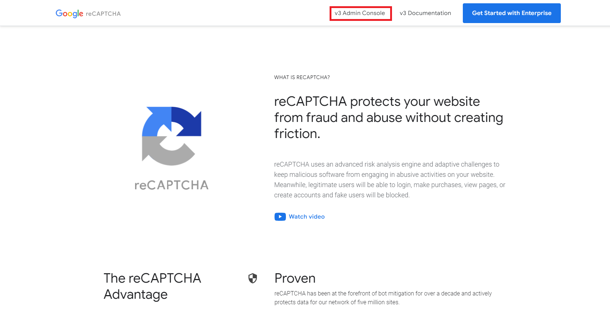


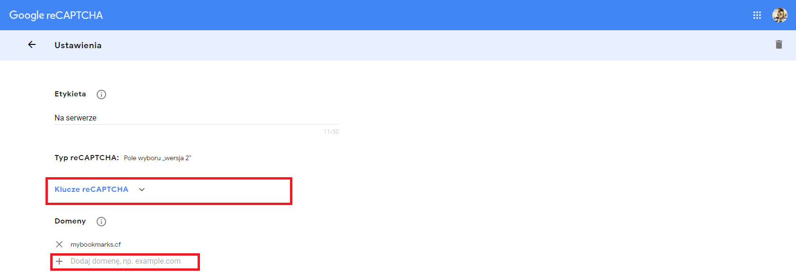

## Tree directory   
   - 📂 __config__
     - 📄 [config\_dist.php](config/config_dist.php)
   - 📄 [index.php](index.php)
   - 📂 __public__
     - 📂 __css__
       - 📄 [contact.css](public/css/contact.css)
       - 📄 [profile.css](public/css/profile.css)
       - 📄 [style.css](public/css/style.css)
     - 📂 __images__
       - 📂 __SocialMedia__
         - 📄 [facebook.png](public/images/SocialMedia/facebook.png)
         - 📄 [instagram.png](public/images/SocialMedia/instagram.png)
         - 📄 [linkedin.png](public/images/SocialMedia/linkedin.png)
         - 📄 [twitter.png](public/images/SocialMedia/twitter.png)
         - 📄 [youtube.png](public/images/SocialMedia/youtube.png)
       - 📄 [avatar.png](public/images/avatar.png)
     - 📂 __js__
       - 📄 [main.js](public/js/main.js)
   - 📂 __readme\_img__
     - 📂 __components__
       - 📄 [button.dropdown.hide.png](readme_img/components/button.dropdown.hide.png)
       - 📄 [button.dropdown.show.png](readme_img/components/button.dropdown.show.png)
       - 📄 [button.link.png](readme_img/components/button.link.png)
       - 📄 [error\_1.png](readme_img/components/error_1.png)
       - 📄 [error\_2.png](readme_img/components/error_2.png)
       - 📄 [form.checbox.png](readme_img/components/form.checbox.png)
       - 📄 [form.select.data.png](readme_img/components/form.select.data.png)
       - 📄 [form.select\_1.png](readme_img/components/form.select_1.png)
       - 📄 [form.select\_2.png](readme_img/components/form.select_2.png)
     - 📂 __menu__
       - 📄 [guest.png](readme_img/menu/guest.png)
       - 📄 [user.png](readme_img/menu/user.png)
     - 📂 __other__
       - 📄 [rules.png](readme_img/other/rules.png)
     - 📂 __template__
       - 📄 [login.png](readme_img/template/login.png)
       - 📄 [profile.png](readme_img/template/profile.png)
       - 📄 [register.png](readme_img/template/register.png)
   - 📄 [recaptchalib.php](recaptchalib.php)
   - 📂 __routes__
     - 📄 [routes.php](routes/routes.php)
   - 📂 __sql__
     - 📄 [database.sql](sql/database.sql)
   - 📂 __src__
     - 📂 __Component__
       - 📄 [Component.php](src/Component/Component.php)
       - 📄 [Rules.php](src/Component/Rules.php)
     - 📂 __Controller__
       - 📄 [AuthController.php](src/Controller/AuthController.php)
       - 📄 [Controller.php](src/Controller/Controller.php)
       - 📄 [GeneralController.php](src/Controller/GeneralController.php)
       - 📄 [UserController.php](src/Controller/UserController.php)
     - 📂 __Exception__
       - 📄 [AppException.php](src/Exception/AppException.php)
       - 📄 [ConfigurationException.php](src/Exception/ConfigurationException.php)
       - 📄 [NotFoundException.php](src/Exception/NotFoundException.php)
       - 📄 [StorageException.php](src/Exception/StorageException.php)
     - 📂 __Helper__
       - 📄 [CheckBox.php](src/Helper/CheckBox.php)
       - 📄 [Request.php](src/Helper/Request.php)
       - 📄 [Session.php](src/Helper/Session.php)
     - 📂 __Model__
       - 📄 [Auth.php](src/Model/Auth.php)
       - 📄 [Config.php](src/Model/Config.php)
       - 📄 [Mail.php](src/Model/Mail.php)
       - 📄 [Model.php](src/Model/Model.php)
       - 📄 [Route.php](src/Model/Route.php)
       - 📄 [Rules.php](src/Model/Rules.php)
       - 📄 [User.php](src/Model/User.php)
     - 📂 __Repository__
       - 📄 [AuthRepository.php](src/Repository/AuthRepository.php)
       - 📄 [Repository.php](src/Repository/Repository.php)
       - 📄 [UserRepository.php](src/Repository/UserRepository.php)
     - 📂 __Rules__
       - 📄 [AuthRules.php](src/Rules/AuthRules.php)
       - 📄 [UserRules.php](src/Rules/UserRules.php)
     - 📂 __Utils__
       - 📄 [debug.php](src/Utils/debug.php)
     - 📂 __Validator__
       - 📄 [Validator.php](src/Validator/Validator.php)
     - 📄 [View.php](src/View.php)
   - 📂 __templates__
     - 📂 __auth__
       - 📄 [forgotPassword.php](templates/auth/forgotPassword.php)
       - 📄 [login.php](templates/auth/login.php)
       - 📄 [register.php](templates/auth/register.php)
       - 📄 [resetPassword.php](templates/auth/resetPassword.php)
     - 📂 __component__
       - 📂 __button__
         - 📄 [dropdown.php](templates/component/button/dropdown.php)
         - 📄 [link.php](templates/component/button/link.php)
       - 📄 [error.php](templates/component/error.php)
       - 📂 __form__
         - 📄 [checkbox.php](templates/component/form/checkbox.php)
         - 📄 [input.php](templates/component/form/input.php)
         - 📄 [select.php](templates/component/form/select.php)
         - 📄 [submit.php](templates/component/form/submit.php)
     - 📂 __general__
       - 📄 [contact.php](templates/general/contact.php)
       - 📄 [home.php](templates/general/home.php)
       - 📄 [policy.php](templates/general/policy.php)
       - 📄 [regulations.php](templates/general/regulations.php)
     - 📂 __layout__
       - 📄 [main.php](templates/layout/main.php)
     - 📄 [messages.php](templates/messages.php)
     - 📂 __user__
       - 📄 [profile.php](templates/user/profile.php)
   - 📂 __uploads__
     - 📂 __images__
       - 📂 __avatar__

## Table of contents
- [Screenshots](#screenshots)
- [Routing](#routing)
  - [How to create new routing](#how-to-create-new-routing)
  - [How use routing](#how-use-routing)
- [Routes](#routes)
- [Rules](#rules)
  - [How to create new rule](#how-to-create-new-rule)
  - [Rules model](#rules-model)
  - [How use getType() and getRule()](#how-use-gettype-and-getrule)
- [Controllers](#controllers)
  - [How to create new controller](#how-to-create-new-controller)
  - [Controller](#controller)
  - [AuthController](#authcontroller)
  - [UserController](#usercontroller)
  - [GeneralController](#generalcontroller)
- [Models](#models)
  - [How to create new model](#how-to-create-new-model)
  - [Model](#abstract-model)
  - [Auth](#auth)
  - [User](#user)
  - [Mail](#mail)
- [Repositories](#repositories)
  - [How to create new repository](#how-to-create-new-repository)
  - [Repository](#abstract-repository)
  - [AuthRepository](#authrepository)
- [Validator](#validator)
  - [How validate data](#how-validate-data)
  - [Available methods to validate data](#available-methods-to-validate-data)
  - [Available methods to validate images](#available-methods-to-validate-images)
- [View](#view)
- [Components](#component)
  - [How to create new component](#how-to-create-new-component)
  - [Methods](#methods)
  - [Component rules](#component-rules)
  - [Avaiable components](#available-components)
- [Helpers](#helpers)
  - [Session](#session)
  - [Request](#request)
  - [Checkbox](#checkbox)

## Screenshots
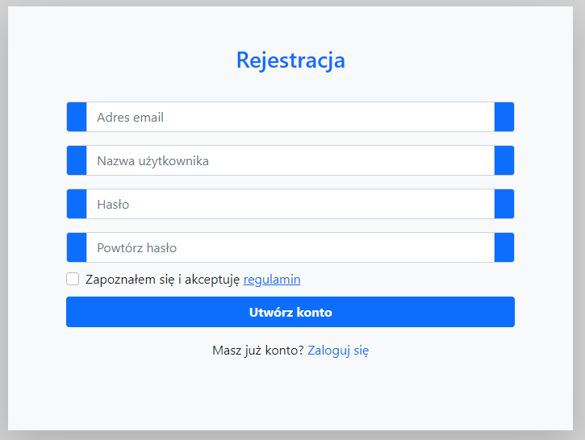

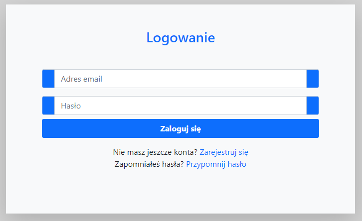

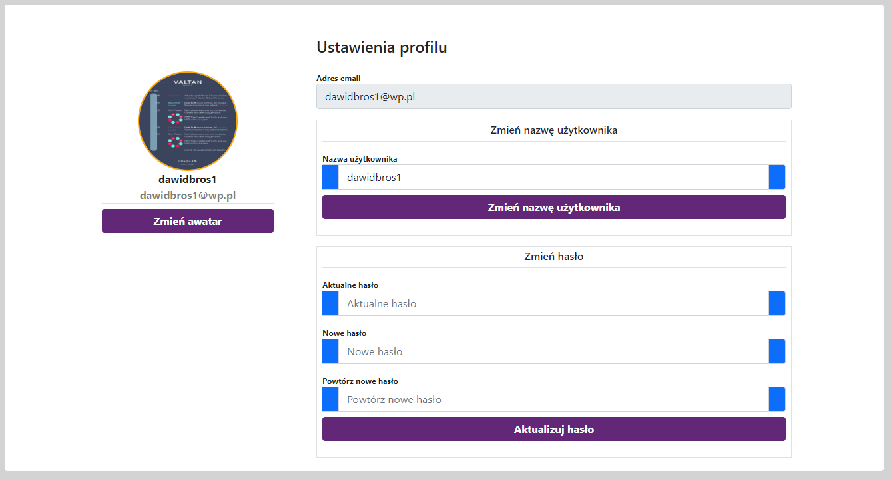

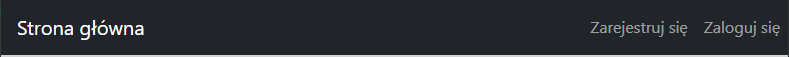


## Routing
### How to create new routing
Create a new route in `routes/routes.php` by method `group()`.
```
$route->group('user', ['logout', 'profile', 'update']);
```

or `register()`
```
$route->register('user', 'logout');
$route->register('user', 'profile');
$route->register('user', 'update');
```

### Route model
* **group(string $prefix, array $names)**: Method adds new routes to array by method `register()`.
```
public function group(string $prefix, array $names)
{
    foreach ($names as $name) {
        $this->register($prefix, $name);
    }
}
```

* **register(string $prefix, string $name)**" Method adds new route to array.
```
public function register(string $prefix, string $name)
{
    if (strlen($prefix) == 0) {
        $this->routes[$name] = "?action=" . $name;
    } else {
        $this->routes[$prefix][$name] = "?type=$prefix&action=$name";
    }
}
```

* **get($path)**: Method returns url of route by $path.
```
public function get($path)
{
    $output = $this->routes;
    $array = explode(".", $path);

    foreach ($array as $name) {
        if (array_key_exists($name, $output)) {
            $output = $output[$name];
        } else {
            throw new AppException("The specified routing key [$path] does not exist");
        }
    }

    return $output;
}
```

### How use routing
```
$this->redirect('auth.login', ['email' => $this->user->email]);
```

## Routes
| Method | URI ( ./? ) | Action | Name |
| --- | --- | --- | --- |
| GET | action=home | src/Controller/GeneralController@homeAction | home |
| GET | action=regulations | src/Controller/GeneralController@policyAction | regulations |
| GET | action=policy | src/Controller/GeneralController@regulationsAction | pollicy |
| GET\|POST | action=contact| src/Controller/GeneralController@contactAction | contact |
| GET\|POST | type=auth&action=register | src/Controller/AuthController@registerAction | auth.register |
| GET\|POST | type=auth&action=login | src/Controller/AuthController@loginAction | auth.login |
| GET\|POST | type=auth&action=forgotPassword | src/Controller/AuthController@forgotPasswordAction | auth.forgotPassword |
| GET\|POST | type=auth&action=resetPassword&code=... | src/Controller/AuthController@resetPasswordAction | auth.resetPassword |
| ANY | type=user&action=logout | src/Controller/UserController@logoutAction | user.logout |
| GET | type=user&action=profile | src/Controller/UserController@profileAction | user.profile |
| POST | type=user&action=update&update=... | src/Controller/UserController@updateAction | user.update |

## Rules
Class `src/model/rules` is created to define validate rules. We can create new rule with method `createRule()`, and next add error message to rule with method `createMessages()`.

### How to create new rule
1. Create new file in `src/rules/` with name like a **NameRules.php**
2. Example rule file:
```
<?php

declare (strict_types = 1);

namespace App\Rules;

use App\Model\Rules;

class AuthRules extends Rules
{
    public function rules()
    {
        $this->createRule('username', ['min' => 3, "max" => 16]);
    }

    public function messages()
    {
        $this->createMessages('username', [
            'min' => "Username cannot contain less than ". $this->value('username.min') .  "characters",
            'max' => "Username cannot contain more than ". $this->value('username.max') . " characters",
        ]);
    }
}
```
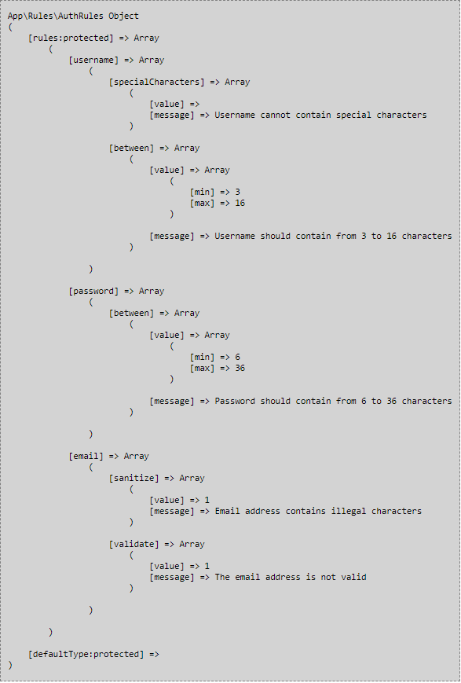

`min` and `max` rules can be package in `between` rule like here:
```
class AuthRules extends Rules
{
    public function rules()
    {
        $this->createRule('username', ['between' => ['min' => 3, "max" => 16]]);
    }

    public function messages()
    {
        $this->createMessages('username', [
            'between' => "Username should contain from " . $this->between('username.min') . " to " . $this->between('username.max') . " characters",
        ]);
    }
}
```
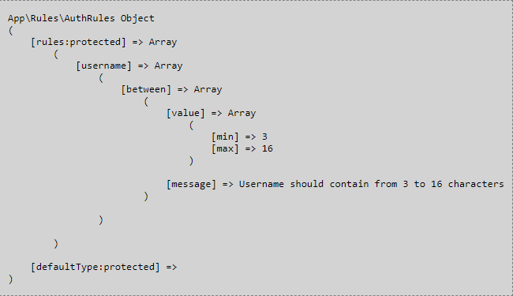

### Rules model
* **createRule(string $type, array $rules): void**: Method adds type of rule with rules to array.
```
public function createRule(string $type, array $rules): void
{
  foreach ($rules as $name => $value) {
      $this->rules[$type][$name]['value'] = $value;
  }
}
```
```
public function rules()
{
    $this->createRule('username', ['min' => 3, "max" => 16, 'specialCharacters' => false]);
}
```

* **value(?string $name = null)**: It is a short function that returns value of any rule.
```
public function value(?string $name = null)
{
  return $this->getRule($name)['value'];
}
```
``` 
$this->value(username.min) // return 3
$this->value(username.max) // return 16
```

* **between(string $name)**: It is a short function that returns value of between rule.
```
public function between(string $name)
{
    $typeName = strtok($name, '.');
    $limit = substr($name, strpos($name, '.') + 1);
    return $this->getRule($typeName . ".between")['value'][$limit];
}
```
```
public function rules()
{
    $this->createRule('username', ['between' => ['min' => 3, "max" => 16]]);
}

$this->between(username.min) // return 3
$this->between(username.min) // return 16
```
 
* **createMessages(string $type, array $rules): void**: Method adds error messages to rules.
```
public function createMessages(string $type, array $rules): void
{
  foreach ($rules as $name => $message) {
    $this->rules[$type][$name]['message'] = $message;
  }
}
```
```
public function messages()
{
    $this->createMessages('username', [
        'min' => "Username cannot contain less than ". $this->value('username.min') . " characters",
        'max' => "Username cannot contain more than ". $this->value('username.max') . " characters",
        'specialCharacters' => "Username cannot contain special characters",
    ]);
}
```

* **message(?string $name = null: string): string**: It is a short function that returns error message of any rule.
```
public function message(?string $name = null): string
{
  return $this->getRule($name)['message'];
}
```
```
$this->message(username.min) // return "Username cannot contain less than 3 characters"
$this->message(username.max) // return "Username cannot contain more than 16 characters"
```

* **arrayValue(string $name, bool $uppercase = false): string**: Method returns array of value rules as string.
```
public function arrayValue(string $name, bool $uppercase = false): string
{
  $type = strtok($name, '.');
  $rule = substr($name, strpos($name, '.') + 1);
  $output = '';

  if(!is_array($this->rules[$type][$rule]['value'])){
      throw new AppException(`Value of [$name] is not an array);
  }

  foreach ($this->rules[$type][$rule]['value'] as $value) {
      $output .= $value . ', ';
  }

  if ($uppercase) { $output = strtoupper($output);}
  $output = substr($output, 0, -2);
  return $output;
}
```
```
public function rules()
{
    $this->createRule('avatar', [
        'types' => ['jpg', 'png', 'jpeg', 'gif'],
    ]);
}

public function messages()
{
    $this->createMessages('avatar', [
       'types' => "The uploaded file has an illegal extension. Allowed extensions are:". $this->arrayValue('avatar.types', true),
    ]);
}

$this->arrayValue("avatar.types") // return "JPG, PNG, JPEG, GIF"
```

* **hasType(string $type): bool**: Method check if exists `$this->rules` with type.
```
public function hasType(string $type): bool
{
  if (array_key_exists($type, $this->rules)) {
      return true;
  } else {
      return false;
  }
}
```
```
hasType("username") // true
hasType("firstname") // false
```

* **typeHasRules(array $keys, ?string $type = null): bool**: Method check if exists `$this->rules[$type]` with all input rules.
```
public function typeHasRules(array $rules, ?string $type = null): bool
{
  if ($this->selectedType != null) {
      $type = $this->rules[$this->selectedType];
  } elseif ($type == null) {
      throw new AppException('Rule type has not been entered');
  } elseif (!$this->hasType($type)) {
      throw new AppException('Input type [' . $type . '] does not exists');
  } else {
      $type = $this->rules[$type];
  }

  foreach ($rules as $rule) {
      if (!array_key_exists($rule, $type)) {
          return false;
      }
  }

  return true;
}
```
```
$this->typeHasRules(["min","max"], "username") // return true
$this->typeHasRules(["require"], "username") // return false
```
* **setDefaultType(string $type): void**: Method sets defaultType on input `$type`.
```
public function setDefaultType(string $type): void
{
  if (!$this->hasType($type)) {
      throw new AppException('The selected type does not exist');
  }
  $this->defaultType = $type;
}
```

If defaultType is sets, we don't need send type of rules to methods like a value() or message();
```
$this->setDefaultType("username")
$this->value("min") // return 3
$this->message("min") // return "Username cannot contain less than 3 characters"
```
* **clearDefaultType(): void** : Method sets defaultType on null.
```
public function clearDefaultType(): void
{
  $this->defaultType = null;
}
```

* **getType(): array**: Method returns rules of type.
```
public function getType(?string $type = null): array
{
  if ($type === null) {
      if ($this->defaultType !== null) {
          return $this->rules[$this->defaultType];
      } else {
          throw new AppException('Rule type has not been entered');
      }
  } else {
      if (!$this->hasType($type)) {
          throw new AppException('Input type [' . $type . '] does not exists');
      } else {
          return $this->rules[$type];
      }
  }
}
```

* **getRule(string $name): array**: Method returns rule (value + message).
```
private function getRule(string $name): array
{
  if ($this->selectedType) {
      return $this->getType()[$name]; // Name like a min | max
  } else {
      $typeName = strtok($name, '.');
      $ruleName = substr($name, strpos($name, '.') + 1);

      $type = $this->getType($typeName); // Name like a password.min | password.max

      if ($this->typeHasRules([$ruleName], $typeName)) {
          return $type[$ruleName];
      } else {
          throw new AppException('Wybrana reguła nie istnieje');
      }
  }
}
```

#### How use getType() and getRule()
```
username <-- type | getType("username") or getType() if defaultType === "username"
{ 
    min: <-- rule | getRule("username.min") or getRule("min") if defaultType === "username"
    {
        value: 3
        message: Username cannot contain less than 3 characters
    },

    max:
    {
        value 16
        message: Username cannot contain more than 16 characters
    }
}
```

## Controllers
### How to create new controller
1. Create new file in `src/controller/` with name like a **NameController.php**
2. Example controller file:
```
<?php

declare (strict_types = 1);

namespace App\Controller;

use App\Controller\Controller;
use App\Helper\Request;
use App\Helper\Session;
use App\View;

class AuthController extends Controller
{
    public function __construct(Request $request)
    {
        parent::__construct($request);
        $this->model = new Auth();
    }
}
```

### Controller
* **initConfiguration(Config $config, Route $route): void**: Initialization properties like a config and route.
```
public static function initConfiguration(Config $config, Route $route): void
{
  self::$config = $config;
  self::$route = $route;
}
```

* **__construct(Request $request)**: Performing the necessary steps for the proper operation of the application.
```
public function __construct(Request $request)
{
    if (empty(self::$config->get('db'))) {
        throw new ConfigurationException('Configuration error');
    }

    Model::initConfiguration(self::$config->get('hash.method'));
    Repository::initConfiguration(self::$config->get('db'));

    $this->mail = new Mail(self::$config->get('mail'));
    $this->userModel = new User();

    if ($id = Session::get('user:id')) {
        $this->user = $this->userModel->findById(User::ID());
    }

    $this->request = $request;
    $this->view = new View($this->user, self::$route);
}
```

* **run(): void**: Method run selected action by `$this->$action();`
```
public function run(): void
{
  try {
      $action = $this->action() . 'Action';
      if (!method_exists($this, $action)) {
          Session::error('The action you wanted to access does not exist');
          $this->redirect("./");
      }

      $this->$action();
  } catch (StorageException $e) {
      $this->view->render('error', ['message' => $e->getMessage()]);
  }
}
```
In **index.php** we run method `run()`
```
(new $controller($request))->run();
```

* **redirect(string $to, array $params = []): void**: Method creates output url by input parameters.
```
protected function redirect(string $to, array $params = []): void
{
  $location = $to;

  if (count($params)) {
      $queryParams = [];
      foreach ($params as $key => $value) {
          if (gettype($value) == "integer") {
              $queryParams[] = urlencode($key) . '=' . $value;
          } else {
              $queryParams[] = urlencode($key) . '=' . urlencode($value);
          }
      }

      $location .= ($queryParams = "&" . implode('&', $queryParams));
  }

  header("Location: " . $location);
  exit();
}
```
example:
```
to: ?type=auth&action=register <-- auth.register
params:
(
    [username] => test
    [email] => test@wp.pl
)

OUTPUT: ?type=auth&action=register&username=test&email=test%40wp.pl
```

* **action(): string**: Method returns action parameter from request.
```
final private function action(): string
{
  return $this->request->getParam('action', "home");
}
 ```

* **guest(): void**: Method require to user was not logged in.
```
final protected function guest(): void
{
  if ($this->user != null) {
      Session::error("The page you tried to access is only available to users who are not logged in.");
      $this->redirect(self::$route->get('home'));
  }
}
 ```

* **requireLogin(): void**: Method require to user was logged in.
```
final protected function requireLogin(): void
{
  if ($this->user == null) {
      Session::error("The page you tried to access requires login.");
      $this->redirect(self::$route->get('auth.login'));
  }
}
```

* **requireAdmin()**: Method require to logged in user had role admin.
```
final protected function requireAdmin(): void
{
  $this->requireLogin();

  if (!$this->user->isAdmin()) {
      Session::error("You do not have sufficient permissions for the action you wanted to perform");
      $this->redirect(self::$route->get('home'));
  }
}
```

### AuthController
* **registerAction(): void**: Method get data to register and next `$this->model->register($data)`.
```
public function registerAction(): void
{
    if ($data = $this->request->isPost(['username', 'email', 'password', 'repeat_password'])) {
        $data['avatar'] = self::$config->get('default.path.avatar');
        $data['regulations'] = Checkbox::get($this->request->postParam('regulations', false));

        if ($this->model->register($data)) {
            $this->redirect(self::$route->get('auth.login'), ['email' => $data['email']]);
        } else {
            unset($data['password'], $data['repeat_password']);
            $this->redirect(self::$route->get('auth.register'), $data);
        }
    } else {
        $this->view->render('auth/register', $this->request->getParams(['username', 'email']));
    }
}
```

* **loginAction(): void**: Method get data to login and next `$this->model->login($data)`.
```
public function loginAction(): void
{
    if ($data = $this->request->isPost(['email', 'password'])) {
        if ($this->model->login($data)) {
            $this->redirect(self::$config->get('default.route.home'));
        } else {
            if ($this->model->existsEmail($email)) {
                Session::set("error:password:incorrect", "The entered password is incorrect");
            } else {
                Session::set("error:email:null", "The email address provided does not exist");
            }
            unset($data['password']);
            $this->redirect(self::$route->get('auth.login'), $data);
        }

    } else {
        $this->view->render('auth/login', ['email' => $this->request->getParam('email')]);
    }
}
```

* **forgotPasswordAction(): void**: Method sends email to user by `$this->mail->forgotPassword(...)`.
```
public function forgotPasswordAction(): void
{
    if ($email = $this->request->isPost(['email'])) {
        if ($this->auth->existsEmail($email)) {
            $username = $this->model->find(['email' => $email])->username;
            $this->mail->forgotPassword($email, self::$route->get('auth.resetPassword'), $username);
        } else {
            Session::set("error:email:null", "The email address provided does not exist");
        }
        $this->redirect(self::$route->get('auth.forgotPassword'));
    } else {
        $this->view->render('auth/forgotPassword');
    }
}
```

* **resetPasswordAction(): void**: Method set new password by  `$this->auth->resetPassword(...)`.
```
public function resetPasswordAction()
{
  if ($data = $this->request->isPost(['password', 'repeat_password', 'code'])) {
      $this->checkCodeToResetPassword($code = $data['code']);

      if ($this->auth->resetPassword($data, $code)) {
          $this->redirect(self::$route->get('auth.login'), ['email' => $user->email]);
      } else {
          $this->redirect(self::$route->get('auth.resetPassword'), ['code' => $code]);
      }
  }

  if ($this->request->isGet() && $code = $this->request->getParam('code')) {
      $this->checkCodeToResetPassword($code);
      $this->view->render('auth/resetPassword', ['email' => Session::get($code), 'code' => $code]);
  } else {
      Session::set('error', 'Password reset code has not been provided');
      $this->redirect(self::$route->get('auth.forgotPassword'));
  }
}
```

* **checkCodeToResetPassword(): void**: Method check if code to reset password exists and is valid.
```
private function checkCodeToResetPassword($code): void
{
  $names = [$code, "created:" . $code];

  if (Session::hasArray($names)) {
      if ((time() - Session::get("created:" . $code)) > 86400) {
          Session::set('error', 'The link to reset your password has expired');
          Session::clearArray($names);
          $this->redirect(self::$route->get('auth.forgotPassword'));
      }
  } else {
      Session::set('error', 'Invalid password reset code');
      $this->redirect(self::$route->get('auth.forgotPassword'));
  }
}
```

### UserController
* **logoutAction()**: Method runs `$this->user->logout()` on model.

```
public function logoutAction(): void
{
    $this->user->logout();
    $this->redirect(self::$route->get('auth.login'), ['email' => $this->user->email]);
}
```

* **profileAction()**: Method shows user profile.
```
public function profileAction()
{
  $this->view->render('user/profile');
}
```

* **updateAction()**: Method runs one of available update function.
```
public function updateAction(): void
{
    if ($toUpdate = $this->request->isPost(['update'])) {
        if (in_array($toUpdate, ['username', 'password', 'avatar'])) {
            $action = "update" . ucfirst($toUpdate);
            $this->$action();
        }
    }

    $this->redirect(self::$route->get('user.profile'));
}
```

* **updateUsername()**: Method change user username by runs `$this->user->updateUsername(...)` on model.
```
private function updateUsername(): void
{
    if ($username = $this->request->hasPostName('username')) {
        $this->user->updateUsername(['username' => $username]);
    }
}
```

* **updatePassword()**: Method change user password by runs `$this->user->updatePassword(...)` on model.
```
private function updatePassword(): void
{
    if ($data = $this->request->hasPostNames(['current_password', 'password', 'repeat_password'])) {
        $this->user->updatePassword($data);
    }
}
```

* **updateAvatar()**: Method change user avatar by runs `$this->user->updateAvatar(...)` on model.
```
private function updateAvatar(): void
{
    $path = self::$config->get('upload.path.avatar');
    $defaultAvatar = self::$config->get('default.path.avatar');

    if ($file = $this->request->file('avatar')) {
        $this->user->updateAvatar($file, $path, $defaultAvatar);
    }
}
```

### GeneralController
* **homeAction()**: Method shows home page.
```
public function homeAction()
{
  View::set(['title' => "Home"]);
  $this->view->render('general/home');
}
```

* **policyAction()**: Method shows privacy policy page.
```
public function policyAction()
{
  View::set(['title' => "privacy policy"]);
  $this->view->render('general/policy');
}
```

* **regulationsAction()**: Method shows regulations page.
```
public function regulationsAction()
{
  View::set(['title' => "Regulations"]);
  $this->view->render('general/regulations');
}
```
   
* **contactAction()**: Method sends email with link to reset password by runs `$this->mail->contact(...)` on mail model.
```
public function contactAction()
{
  View::set(['title' => "Contact page", 'style' => "contact"]);
  $names = ['name', 'from', 'message', 'subject', 'g-recaptcha-response'];

  if ($this->request->isPost() && $this->request->hasPostNames($names)) {
      $secret = self::$config->get('reCAPTCHA.key.secret');
      $response = null;
      $reCaptcha = new \ReCaptcha($secret);

      $data = $this->request->postParams($names);

      $response = $reCaptcha->verifyResponse(
          $_SERVER["REMOTE_ADDR"],
          $data['g-recaptcha-response']
      );

      if ($response != null && $response->success) {
           $this->mail->contact($data);
      } else {
          Session::set('error:reCAPTCHA:robot', "We don't let robots in");
      }

      $this->redirect(self::$route->get('contact'));
  }

  $path = self::$config->get('default.path.medium') ?? "";
  $this->view->render('general/contact', ['path' => $path, 'sideKey' => self::$config->get('reCAPTCHA.key.side')]);
}
```

## Models
### How to create new model
1. Create new file in `src/model/` with name like a **User.php**
2. Example model file:
```
<?php

declare (strict_types = 1);

namespace App\Model;

use App\Helper\Session;
use App\Repository\UserRepository;
use App\Rules\UserRules;

class User extends Model
{
    public $fillable = ['id', 'username', 'email', 'password', 'avatar', 'role', 'created'];

    public function __construct()
    {
        $this->rules = new UserRules();
        $this->repository = new UserRepository();
    }
}
```

Each model related with database need declare property `$fillable` (columns in database) like this:
```
public $fillable = ['id', 'username', 'email', 'password', 'avatar', 'role', 'created'];
```

In `__construct()` we need create repository and rules like this: 
```
public function __construct()
{
    $this->rules = new UserRules();
    $this->repository = new UserRepository();
}
```

### Abstract model
Model is abstract class which have a lot of useful methods.
* **initConfiguration($hashMethod)**: Initialization property like a validator and hashMethod.
```
public static function initConfiguration($hashMethod)
{
    self::$validator = new Validator();
    self::$hashMethod = $hashMethod;
}
```

* **__construct(array $data = [], bool $onlyFillable = false)**: Creates rules and repository if needs and sets data if is not empty.
```
public function __construct(array $data = [], bool $onlyFillable = false)
{
    $className = $this->getClassName();

    if ($onlyFillable == false) {
        $rules = "App\Rules\\" . $className . "Rules";
        $repository = "App\Repository\\" . $className . "Repository";

        $this->rules = new $rules;
        $this->repository = new $repository;
    }

    $this->set($data);
}
```

* **set($data)**: Method sets all fillable properties in object.
```
public function set($data)
{
    foreach ($data as $key => $value) {
        if (in_array($key, $this->fillable)) {
            $this->$key = $value;
        }
    }
}
```

* **find(array $input, string $options = "")**: Method returns one record from database as object.
```
public function find(array $input, string $options = "", bool $onlyFillable = false)
{
    if ($data = $this->repository->get($input, $options)) {
        return $this->createObject($data, $onlyFillable);
    }

    return null;
}
```

* **findById($id)**: Method returns one record from database by ID as object.
```
public function findById($id)
{
    return $this->find(['id' => $id]);
}
```

* **findAll(array $input, string $options = "")**: Method returns many records from database as array of object.
```
public function findAll(array $input, string $options = "", bool $onlyFillable = true)
{
    $output = [];
    $data = $this->repository->getAll($input, $options);
    $className = $this->getClassName();
    $model = "App\Model\\" . $className;

    if ($data) {
        foreach ($data as $item) {
            $output[] = $this->createObject($item, $onlyFillable);
        }
    }

    return $output;
}
```

* **createObject($data, $onlyFillable)**: Method returns object with initialized data.
```
private function createObject($data, $onlyFillable)
{
    $className = $this->getClassName();
    $model = "App\Model\\" . $className;
    return new $model($data, $onlyFillable);
}
```

* **validate($data)**: Method validates data and returns status of validated data.
```
protected function validate($data)
{
    return self::$validator->validate($data, $this->rules);
}
```

* **validateImage($FILE, $type)**: Method returns status of validated image.
```
protected function validateImage($FILE, $type)
{
    return self::$validator->validateImage($FILE, $this->rules, $type);
}
```

* **create(array $data, $validate = true)**: Method creates record in database.
```
public function create(array $data, $validate = true)
{
    $data['user_id'] = User::ID();

    if (($validate === true && $this->validate($data)) || $validate === false) {
        $this->set($data);
        $this->repository->create($this);
        return true;
    }

    return false;
}
```

* **update(array $data, array $toUpdate = [], $validate = true)**: Method updates record in database.
```
public function update(array $data, array $toUpdate = [], $validate = true)
{
    if (($validate === true && $this->validate($data)) || $validate === false) {
        $this->set($data);

        if (empty($toUpdate)) {
            $data = $this->getArray($this->fillable);
        } else {
            $data = $this->getArray(['id', ...$toUpdate]);
        }

        $this->escape();
        $this->repository->update($data);
        Session::success('The data has been updated');
        return true;
    }
    return false;
}
```

* **delete(?int $id = null)**: Method deletes record from database.
```
public function delete(?int $id = null)
{
    if ($id !== null) {
        $this->repository->delete((int) $id);
    } else {
        $this->repository->delete((int) $this->id);
    }
}
```

* **getArray($array)**: Method returns selected data from model as array.
```
public function getArray($array)
{
    $properties = get_object_vars($this);

    foreach ($properties as $key => $value) {
        if (!in_array($key, $array)) {
            unset($properties[$key]);
        }
    }

    return $properties;
}
```

* **escape()**: Method escapes (htmlentities) data in model.
```
public function escape()
{
    foreach ($this->fillable as $index => $key) {
        if (property_exists($this, $key)) {
            $this->$key = htmlentities((string) $this->$key);
        }
    }
}
```

* **uploadFile($path, $FILE): bool**: Method uploads file on server.
```
protected function uploadFile($path, $FILE): bool
{
  $target_dir = $path;
  $type = strtolower(pathinfo($FILE['name'], PATHINFO_EXTENSION));
  $target_file = $target_dir . basename($FILE["name"]);

  if (move_uploaded_file($FILE["tmp_name"], $target_file)) {
      return true;
  } else {
      Session::set('error', 'Sorry, there was a problem sending the file');
      return false;
  }
}
```
example: 
```
HTML: <input type = "file" name = "avatar">

if ($file = $this->request->file('avatar')) {
    if ($this->validateImage($file, $this->rules, 'avatar')) {
        $file = $this->hashFile($file);
        if ($this->uploadFile($path, $file)) {
            FILE WAS UPLOADED ...
        }
    }
}
```

* **hash($param, $method = null): string**: Method returns hash of parameter.
```
protected function hash($param, $method = null): string
{
  return hash($method ?? $this->hashMethod, $param);
}
```

* **hashFile($file)**: Method returns **$file** object with unique filename.
```
protected function hashFile($file)
{
  $type = strtolower(pathinfo($file['name'], PATHINFO_EXTENSION));
  $name = $this->hash(date('Y-m-d H:i:s') . "_" . $file['name']);
  $file['name'] = $name . '.' . $type;
  return $file;
}
```

* **getClassName()** Method returns name of class for current object.
```
private function getClassName()
{
    $path = explode('\\', get_class($this));
    $className = array_pop($path);
    return $className;
}
```

### Auth
* **register(array $data)**: Method runs `$this->create(...)` on model to create user account.
```
public function register(array $data)
{
    if ($status = ($this->validate($data) & !$this->isBusyEmail($data['email']))) {
        $data['password'] = $this->hash($data['password']);
        $data['role'] = "user";
        $data['created'] = date('Y-m-d H:i:s');

        if ($this->create($data, false)) {
            Session::success('The account has been created');
        }
    }

    return $status;
}
```

* **login(array $data)**: Method logins user by set session `user:id` on value `$user->id`.
```
public function login(array $data)
{
    $data['password'] = $this->hash($data['password']);

    if ($user = $this->find(['email' => $data['email'], 'password' => $data['password']])) {
        Session::set('user:id', $user->id);
    }

    return $user;
}
```

* **resetPassword($data, $code)**: Method allows user to set new password.
```
    public function resetPassword($data, $code)
    {
        if ($status = $this->validate($data)) {
            $user = $this->find(['email' => Session::get($code)]);
            $user->update(['password' => $this->hash($data['password'])], ['password'], false);
            Session::clearArray([$code, "created:" . $code]);
            Session::success('The account password has been changed');
        }
        return $user ?? null;
    }
```

* **isBusyEmail($email)**: Method returns true if given **$email** is busy.
```
public function isBusyEmail($email)
{
    if ($this->existsEmail($email)) {
        Session::set("error:email:unique", "The given e-mail address is taken");
        return true;
    }
    return false;
}
```

* **existsEmail($email)**: Method returns true if given **$email** exists.
```
public function existsEmail($email)
{
    return in_array($email, $this->repository->getEmails());
}
```

### User
* **logout()**: Method clear session (user:id).
```
public function logout()
{
    Session::clear('user:id');
    Session::success("You have been logged out of the system");
}
```

* **updateUsername($data)**: Method update user username by runs `$this->save(...)` on repository.
```
public function updateUsername($data)
{
    if ($this->update($data, ['username'])) {
            Session::success("The username has been changed");
    }
}
```

* **updatePassword($data)**: Method updates user password by runs `$this->save(...)` on repository.
```
public function updatePassword($data)
{
    if (!$same = ($this->password == $this->hash($data['current_password']))) {
        Session::set("error:current_password:same", "The password provided is incorrect");
    }


    if ($this->validate($data) && $same) {
        $data['password'] = $this->hash($data['password']);
        if ($this->update($data, ['password'], false)) {
            Session::success('The password has been updated');
        }
    }
}
```

* **updateAvatar($file, $path, $defaultAvatar)**: Method update user avatar by runs `$this->save(...)` on repository.
```
public function updateAvatar($file, $path, $defaultAvatar)
{
    if ($this->validateImage($file, 'avatar')) {
        $file = $this->hashFile($file);

        if ($this->uploadFile($path, $file)) {
            if ($this->avatar != $defaultAvatar) {
                $this->deleteAvatar();
            }

            if ($this->update(['avatar' => $path . $file['name']], ['avatar'], false)) {
                Session::success('The avatar has been updated');
            }
        }
    }
}
```

* **isAdmin()**: Method check if logged in user has role admin.
```
public function isAdmin()
{
    return (bool) ($this->role === "admin");
}
```

* **deleteAvatar()**: Method deletes old user avatar.
```
public function deleteAvatar()
{
    if (file_exists($this->avatar)) {
        unlink($this->avatar);
    }
}
```

### Mail
* **contact(array $data)**: Method sends email to website admin.
```
public function contact(array $data)
{
    $headers = "From: " . strip_tags($data['from']) . "\r\n";
    $headers .= "Reply-To: " . strip_tags($data['from']) . "\r\n";
    $headers .= "MIME-Version: 1.0\r\n";
    $headers .= "Content-Type: text/html; charset=UTF-8\r\n";

    $data['name'] = htmlentities($data['name']);
    $data['message'] = htmlentities($data['message']);

    $html = "<html> <head> </head> <body> <p>Name: " . $data['name'] . " </p> " . $data['message'] . " </body> </html>";

    if ($this->send($this->config['email'], $data['subject'], $html, $headers)) {
        Session::success("Message was sent");
    }
}
```

* **forgotPassword($email, $route, $username)**: Method sends to user message with link to reset password.
```
public function forgotPassword($email, $route, $username)
{
    $location = $_SERVER['REQUEST_SCHEME'] . "://" . $_SERVER['HTTP_HOST'] . parse_url($_SERVER["REQUEST_URI"], PHP_URL_PATH);
    $code = rand(1, 1000000) . "_" . date('Y-m-d H:i:s');
    $hash = $this->hash($code, 'md5');

    Session::set($hash, $email);
    Session::set('created:' . $hash, time());

    $data = [];
    $data['email'] = $email;
    $data['link'] = $location . $route . "&code=$hash";
    $data['subject'] = $_SERVER['HTTP_HOST'] . " - Password reset";
    $data['username'] = $username;

    $headers = "From: " . strip_tags($this->config['email']) . "\r\n";
    $headers .= "Reply-To: " . strip_tags($this->config['email']) . "\r\n";
    $headers .= "MIME-Version: 1.0\r\n";
    $headers .= "Content-Type: text/html; charset=UTF-8\r\n";

    $message = "message to user...";
    $html = "<html><head></head><body>" . $message . "</body></html>";

    if ($this->send($data['email'], $data['subject'], $html, $headers)) {
        Session::success("A link to reset your password has been sent to the email address you provided");
    }
}
```

* **send($email, $subject, $html, $headers)**: Method sends email and return status of email sent.
```
private function send($email, $subject, $html, $headers)
{
    if (mail($email, $subject, $html, $headers)) {
        return true;
    } else {
        Session::set('error', "There was a problem sending your message, please try again later");
        return false;
    }
}
```

## Repositories
Repositories are a collection of methods to communicate with database.

### How to create new repository
1. Create new file in src/repository/ with name like a **UserRepository.php**
2. Example repository file:
```
<?php

declare (strict_types = 1);

namespace App\Repository;

use App\Repository\Repository;

class UserRepository extends Repository
{
    public function __construct()
    {
        $this->table = "users";
        parent::__construct();
    }
}
```
### Abstract repository
* **initConfiguration($config): void**: Method inits config to static property.
```
public static function initConfiguration($config): void
{
  self::$config = $config;
}
```

* **__construct()**: In constructor is created connection with database.
```
public function __construct()
{
  try {
      $this->validateConfig(self::$config);
      $this->createConnection(self::$config);
  } catch (PDOException $e) {
      throw new StorageException('Connection error');
  }
}
```
   
* **validateConfig(array $config): void**: Method validates config data.
```
private function validateConfig(array $config): void
{
  if (
      empty($config['database']) ||
      empty($config['host']) ||
      empty($config['user']) ||
      !isset($config['password'])
  ) {
      throw new ConfigurationException('Storage configuration error');
  }
}
``` 

* **createConnection(array $config): void**: Method creates connection with database.
```
private function createConnection(array $config): void
{
  $dsn = "mysql:dbname={$config['database']};host={$config['host']}";
  self::$pdo = new PDO($dsn, $config['user'], $config['password'], [
      PDO::ATTR_ERRMODE => PDO::ERRMODE_EXCEPTION,
  ]);
}
```

* **get(array $input, $options)**: Method returns record from database.
```
public function get(array $input, $options)
{
    $conditions = $this->getConditions($input);
    $stmt = self::$pdo->prepare("SELECT * FROM $this->table WHERE $conditions $options");
    $stmt->execute($input);
    $data = $stmt->fetch(PDO::FETCH_ASSOC);
    return $data;
}
```

* **getAll(array $input, $options): ?array**: Method returns records from database.
```
public function getAll(array $input, $options): ?array
{
    $conditions = $this->getConditions($input);
    $stmt = self::$pdo->prepare("SELECT * FROM $this->table WHERE $conditions $options");
    $stmt->execute($input);
    $data = $stmt->fetchAll(PDO::FETCH_ASSOC);
    return $data;
}
```

* **getConditions(array $input)**: Method returns conditions to query.
```
private function getConditions(array $input)
{
    $conditions = "";

    foreach ($input as $key => $value) {
        $conditions .= $conditions . " " . $key . "=:" . $key . " AND";
    }

    $conditions .= " 1";

    return $conditions;
}
```

* **create($object)**: Method creates record in database.
```
public function create($object)
{
    $object->escape();
    $data = $object->getArray($object->fillable);
    $params = "";
    $values = "";

    for ($i = 0; $i < count($data); $i++) {
        $params = $params . "" . key($data) . ($i == count($data) - 1 ? "" : ", ");
        $values = $values . ":" . key($data) . ($i == count($data) - 1 ? "" : ", ");
        next($data);
    }

    try {
        $sql = "INSERT INTO $this->table ($params) VALUES ($values)";
        $stmt = self::$pdo->prepare($sql);
        $stmt->execute($data);
    } catch (Throwable $e) {
        throw new StorageException('Nie udało się dodać nowej zawartości', 400, $e);
    }
}
```

* **update($data)**: Method updates record in database.
```
public function update($data)
{
    $params = "";

    for ($i = 0; $i < count($data); $i++) {
        $params = $params . key($data) . "=:" . key($data) . ($i == count($data) - 1 ? "" : ", ");
        next($data);
    }

    $sql = "UPDATE $this->table SET $params WHERE id=:id";
    $stmt = self::$pdo->prepare($sql);
    $stmt->execute($data);
}
```

* **delete(int $id)**: Method deletes record from database.
```
public function delete(int $id)
{
    $sql = "DELETE FROM $this->table WHERE id = :id";
    self::pdo->prepare($sql)->execute(['id' => $id]);
}
```

### AuthRepository
* **getEmails(): array**: Method returns all emeails from database.
```
public function getEmails(): array
{
    $stmt = self::$pdo->prepare("SELECT email FROM users");
    $stmt->execute();
    $emails = $stmt->fetchAll(PDO::FETCH_COLUMN, 'email');
    return $emails;
}
```

## Validator
Validator is use to validate data given by user.

### How validate data
In each model we have declare property `$this->rules` 
```
public function __construct()
{
    $this->rules = new UserRules();
}
```

To validate data we need use method `validate()` in model like this:
```
public function updateData($data)
{
    if ($this->validate($data)) {
        // Validate is OK //
    }
}
```

If validation fails errors will be set to session value with method `setError()`:
```
private function setError($type, $rule, $message)
{
    Session::set("error:$type:$rule", $message);
    return false;
}
```

### Available methods to validate data
* `between` for length of input string
```
if ($rule == "between") {
    $min = $rules->value($rule)['min'];
    $max = $rules->value($rule)['max'];

    if ($this->strlenBetween($input, $min - 1, $max + 1) == false) {
        $ok = $this->setError($type, $rule, $message);
    }
}
```

* `min` and `max` for length of input string
```
else if ($rule == "max" && ($this->strlenMax($input, $value) == false)) {
    $ok = $this->setError($type, $rule, $message);
}
else if ($rule == "min" && ($this->strlenMin($input, $value) == false)) {
    $ok = $this->setError($type, $rule, $message);
}
```

* `validate` and `sanitize` for adress email
```
else if ($rule == "validate" && $value && (!filter_var($input, FILTER_VALIDATE_EMAIL))) {
    $ok = $this->setError($type, $rule, $message);
}
else if ($rule == "sanitize" && $value && ($input != filter_var($input, FILTER_SANITIZE_EMAIL))) {
    $ok = $this->setError($type, $rule, $message);
}
```

* `require` to check if the field is not empty
```
else if ($rule == "require" && $value && (empty($input))) {
    $ok = $this->setError($type, $rule, $message);
}
```

* `specialCharacters` to check if string have special characters
```
else if ($rule == "specialCharacters" && !$value && (preg_match('/[\'^£$%&*()}{@#~"?><>,|=_+¬-]/', $input))) {
    $ok = $this->setError($type, $rule, $message);
}
```

### Available methods to validate images
* `maxSize` to limited max size of image
```
if ($rules->typeHasRules(['maxSize'])) {
    if (($FILE["size"] >= $rules->value('maxSize')) && $uploadOk) {
        Session::set('error:file:maxSize', $rules->message('maxSize'));
        $uploadOk = 0;
    }
}
```

* `types` to check if sent image have extension like a (.png, .jpg etc.)
```
if ($rules->typeHasRules(['types'])) {
    $type = strtolower(pathinfo($FILE['name'], PATHINFO_EXTENSION));

    if (!in_array($type, $rules->value('types'))) {
        Session::set('error:file:types', $rules->message('types'));
        $uploadOk = 0;
    }
}
```

## View
* **__construct($user, $route)**: Initialization of properties like user and route.
```
public function __construct($user, $route)
{
    $this->user = $user;
    $this->route = $route;
}
```

* **set($data)**: Method sets title and styles for page.
```
public static function set($data)
{
    if (array_key_exists('style', $data)) {
        self::$style = $data['style'] ?? null;
    }

    if (array_key_exists('title', $data)) {
        self::$title = $data['title'] ?? null;
    }
}
```

* **render(string $page, array $params = []): void**: Method renders layout with variables.
```
public function render(string $page, array $params = []): void
{
    $user = $this->user;
    $route = $this->route;
    $style = self::$style;
    $title = self::$title;
    require_once 'templates/layout/main.php';
}
```

In `src/templates/layout/main.php` we shows possible messages and renders selected page.
```
<div class="content">
    <?php require_once "templates/messages.php";?>
    <?php require_once "templates/$page.php";?>
</div>
```

* **escape(array $params): array**: Method escapes params by htmlentities().
```
private function escape(array $params): array
{
    $clearParams = [];
    foreach ($params as $key => $param) {

        if (gettype($params === "object")) {
            $clearParams[$key] = $param;
            continue;
        }

        switch (true) {
            case is_array($param):
                $clearParams[$key] = $this->escape($param);
                break;
            case is_int($param):
                $clearParams[$key] = $param;
                break;
            case $param:
                $clearParams[$key] = c($param);
                break;
            default:
                $clearParams[$key] = $param;
                break;
        }
    }

    return $clearParams;
}
```

## Component
Component renders fragment of html with one call.

### How to create new component
Create a new file in `templates/component/` like a **folder/welcome.php**.
```
<div>Welcome: <?=$params['name']?></div>
```

Use component in template:
```
<?php
use App\Component;

<?php Component::render('folder.welcome', ['name' => "Adam"])?>
```

Output:
```
Welcome: Adam
``` 

### Methods
* **render(string $component, array $params = []): void**: Method renders component.
```
public static function render(string $component, array $params = []): void
{
    $path = __DIR__ . self::$default_path . str_replace(".", "/", $component) . ".php";

    if (!file_exists($path)) {
        throw new AppException("Komponent [ $component ] nie istnieje");
    }

    if (array_key_exists('description', $params)) {
        $params['label'] = $params['description'];
        $params['placeholder'] = $params['description'];
        unset($params['description']);
    }

    Component::requireParams($component, $params);
    $styles = Component::getStyles($params);
    include $path;
}
```

* **getStyles(array $params): string**: Method returns unique parameters of styles as string.
```
private static function getStyles(array $params): string
{
    $mt = $params['mt'] ?? "mt-3";
    $class = $params['class'] ?? "";
    $col = $params['col'] ?? "col-12";

    return "$mt $class $col";
}
```

* **requireParams(string $path, array $params)**: The method checks if all required parameters have been passed to the component.
```
public static function requireParams(string $path, array $params)
{
    $rules = Rules::get($path);

    foreach ($rules ?? [] as $rule) {
        if (!array_key_exists($rule, $params)) {
            throw new AppException("Wymagany parametr [ $rule ] nie został wprowadzony");
        }
    }
}
```

### Component rules
* **private static $rules**: Property where insert require params for component.
```
private static $rules = [
    'button' => [
        'link' => ['action', 'text'],
        'dropdown' => ['target', "text"],
    ],

    'form' => [
        'checkbox' => ['id', 'name', 'label'],
        'input' => ['type', 'name'],
        'select' => ['name', 'options', 'selected', 'show', 'label'],
        'submit' => ['text'],
    ],

    'error' => ['names', 'type'],
];
```

* **get($path)**: Method that returns the required parameters to the component.
```
public static function get($path)
{
    $output = self::$rules;
    $array = explode(".", $path);

    foreach ($array as $name) {
        if (array_key_exists($name, $output)) {
            $output = $output[$name];
        } else {
            throw new AppException("Reguły podanego komponentu [ $path ] nie zostały zarejestrowane");
        }
    }

    return $output;
}
```

### Available components
* **error**: Component renders error message in form after validate.
```
Component::render('error', [
    'type' => "username", 
    'names' => ['between', 'specialCharacters']
]);
```

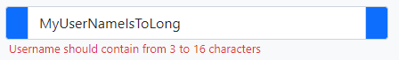
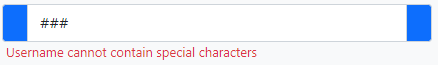

* **button.link**: Component renders button to redirect to selected page.
```
Component::render('button.link', [
    'text' => "register",
    'action' => $route->get('auth.register'),
    'a.class' => "w-50 mx-auto d-block mt-5",
    'buttom.class' => "text-white btn-success",
    'col' => "col-12",
]);
```


* **button.dropdown**: Component renders button which on event onClick dropdown section with selected class.
```
Component::render('button.dropdown', [
    'text' => ["show", 'hide'],
    'target' => "target_class",
    'class' => "text-warning btn-danger",
    'col' => "col-12",
]);

<div class="text-center collapse target_class mt-2 fw-bold"> It works!</div>
```


* **form.checknox**: Component renders checkbox.
```
Component::render('form.checkbox', [
    'id' => "regulations",
    'name' => "regulations",
    'label' => "I have read the regulations",
]);
```


* **form.select**: Component renders select section to form.
```
Component::render('form.select', [
    'name' => "fruits",
    'options' => Fruit::addArray(['watermelon', 'strawberry', 'raspberry', 'peach']),
    'show' => "name",
    'selected' => ['id' => 2],
    'label' => 'Choose your favorite fruit',
    'col' => "col-12",
]);
```
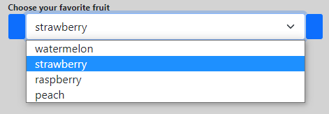

```
Component::render('form.select', [
    'name' => "fruits",
    'options' => Fruit::addArray(['watermelon', 'strawberry', 'raspberry', 'peach']),
    'show' => "id",
    'selected' => ['name' => 'raspberry'],
    'label' => 'Choose your favorite fruit',
    'col' => "col-12",
]);
```
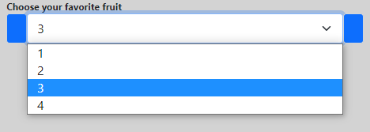

**Array of fruits**:

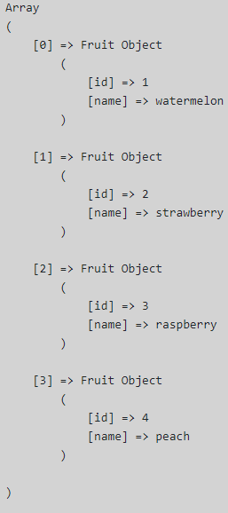

## Helpers
### Session
+ **has($name): bool**: Method checks if exists session with given name.
```
public static function has($name): bool
{
  if (isset($_SESSION[$name]) && !empty($_SESSION[$name])) {return true;} else {return false;}
}
```

+ **hasArray(array $names): bool**: Method checks if exists sessions with given names.
```
public static function hasArray(array $names): bool
{
  foreach ($names as $name) {
      if (!Session::has($name)) {return false;}
  }

  return true;
}
```

+ **get($name)**: Method returns value of session with given name.
```
public static function get($name)
{
  if (Session::has($name) == true) {
      return $_SESSION[$name];
  } else {
      return null;
  }
}
```

+ **getNextClear($name)**: Method returns value of session with given name and next unsets session.
```
public static function getNextClear($name)
{
  $value = Session::get($name);
  Session::clear($name);
  return $value;
}
```

+ **set($name, $value): void**: Method sets value session with given name.
```
public static function set($name, $value): void
{
  $_SESSION[$name] = $value;
}
```

* **success(string $message)**: Short method to set success message.
```
public static function success(string $message)
{
    Session::set('success', $message);
}
```

* **error(string $message)**: Short method to set error message.
```
public static function error(string $message)
{
    Session::set('error', $message);
}
```

+ **clear($name): void**: Method unsets session with given name.
```
public static function clear($name): void
{
  unset($_SESSION[$name]);
}
```

+ **clearArray(array $names): void**: Method clears session with given names.
```
public static function clearArray(array $names): void
{
  foreach ($names as $name) {
      Session::clear($name);
  }
}
```

### Request
* **param(string $name, $default = null)**: Method returns a value regardless of the method type.
```
public function param(string $name, $default = null)
{
    if ($this->isPost()) {
        return $this->postParam($name, $default);
    } else {
        return $this->getParam($name, $default);
    }
}
```

* **isPost()**: Method checks if request method is post. If input parameter $names is not empty, method require to exists post parameters in $names and returns values of them.
```
public function isPost(array $names = [])
{
    if ($status = $this->server['REQUEST_METHOD'] === 'POST') {
        if (!empty($names) && ($status = $this->hasPostNames($names, false))) {
            if (count($data = $this->postParams($names)) == 1) {
                return $data[$names[0]];
            } else {
                return $data;
            }
        }
    }
    return $status;
}
```

* **postParams(array $names)**: Method returns post values of request with given names as array.
```
public function postParams(array $names)
{
    foreach ($names as $name) {
        $output[$name] = $this->postParam($name);
    }

    return $output ?? [];
}
```

* **postParam(string $name, $default = null)**: Method returns post value of request with given name.

```
public function postParam(string $name, $default = null)
{
    return $this->post[$name] ?? $default;
}
```

* **hasPostNames(array $names, bool $returnData = true)**: Method checks if exists post parameters with given names. If input parameter $returnData is set to true, method returns values of post parameters from $names.
```
public function hasPostNames(array $names, bool $returnData = true)
{
    foreach ($names as $name) {
        if ($this->hasPostName($name, false) === false) {
            return false;
        }
    }

    return $returnData ? $this->postParams($names) : true;
}
```

* **hasPostName(string $name)**: Method checks if exists post parameter with given name. If input parameter $returnData is set to true, method returns value of post parameter of $name.
```
public function hasPostName(string $name, bool $returnData = true)
{
    if (!isset($this->post[$name])) {return false;}
    return $returnData ? $this->postParam($name) : true;
}
```

* **isGet(): bool**:  Method checks if request method is get. If input parameter $names is not empty, method require to exists get parameters in $names and returns values of them.
```
public function isGet(array $names = []): bool
{
    if ($status = $this->server['REQUEST_METHOD'] === 'GET') {
        if (!empty($names) && ($status = $this->hasGetNames($names, false))) {
            if (count($data = $this->getParams($names)) == 1) {
                return $data[$names[0]];
            } else {
                return $data;
            }
        }
    }
    return $status;
}
```

* **getParams(array $names)**: Method returns get values of request with given names as array.
```
public function getParams(array $names)
{
    foreach ($names as $name) {
        $output[$name] = $this->getParam($name);
    }

    return $output ?? [];
}
```

* **getParam(string $name, $default = null)**: Method returns get value of request with given name.
```
public function getParam(string $name, $default = null)
{
    return $this->get[$name] ?? $default;
}
```

* **hasGetNames(array $names, bool $returnData = true)**: Method checks if exists get parameters with given names. If input parameter $returnData is set to true, method returns values of get parameters from $names.
```
public function hasGetNames(array $names, bool $returnData = true)
{
    foreach ($names as $name) {
        if ($this->hasGetName($name, false) === false) {
            return false;
        }
    }

    return $returnData ? $this->getParams($names) : true;
}
```

* **hasGetName(string $name, bool $returnData = true)**: Method checks if exists get parameter with given name. If input parameter $returnData is set to true, method returns value of get parameter from $name.
```
public function hasGetName(string $name, bool $returnData = true)
{
    if (!isset($this->get[$name])) {return false;}
    return $returnData ? $this->getParam($name) : true;
}
```

* **queryString(): string**: Method returns request parameters as string.
```
public function queryString(): string
{
    return $this->server['QUERY_STRING'];
}
```

* **file(string $name, $default = null)**: Method checks if is sent file with input name.
```
public function file(string $name, $default = null)
{
    return $this->files[$name] ?? $default;
}
```

### Checkbox
* **get**: Method returns 1 or 0 in dependens if checkbox exists.
```
public static function get($checkbox)
{
    if ($checkbox) {return 1;} else {return 0;}
}
```