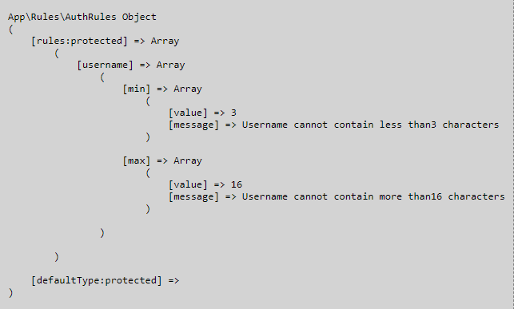
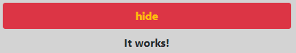

# PHP Start [ Version 3.1 ]
The project is a complete file package to create applications in PHP technology.

## Build with
1. PHP 7.4

## Features
1. Registration / Login
2. Password recovery
3. User profile management (username / photo / password)

## Installation Instructions
1. Run `git clone https://github.com/dawidbros1/php-start.git`
2. Run `composer install`
3. Create a MySQL database for the project
4. From the project root folder run `cd .\config\` and next `copy config_dist.php config.php`
5. Configure your `./config/config.php` file
6. Import tables from file `./sql/database.sql` to your database

## Config
* **project**: Set your project location
* **db**: Set your connection to database
* **mail**: Create email on your hosting and fill field **email**. This email is use to send message by contact form.
* **upload**: This is a place where uploaded files will be send.
* **default**: There are a default value for system like a
    * **path.avatar** it is basic user avatar
    * **path.medium** it is a place where are location social media icons
    * **route.home** it is route after login
    * **route.logout** it is route after logout
    * **hash.method** it is a default method which is use to hash()
* **reCAPTCHA**
You can take keys from https://www.google.com/recaptcha/about/


## Table of contents
- [Screenshots](#screenshots)
- [Routes](#routes)
- [How to create](#how-to-create)
    - [Controller](#controller)
    - [Route](#route)
    - [Rules](#rules)
    - [Model](#model)
    - [Repository](#repository)
- [Validator](#validator)
    - [How to validate data](#how-to-validate-data)
    - [Avaiable methods to validate data](#available-methods-to-validate-data)
    - [Avaiavle methods to validate images](#available-methods-to-validate-images)
- [View](#view)
- [Component](#component)
    - [How to create new component](#how-to-create-new-component)
    - [How use component in template](#how-use-component-in-template)
    - [Avaiable components](#available-components)
- [Helpers](#helpers)

## Screenshots


### Routes
| Method | URL | Action | Name |
| --- | --- | --- | --- |
| GET | / | src/Controller/GeneralController@index | home |
| GET | /regulations | src/Controller/GeneralController@policyAction | regulations |
| GET | /policy | src/Controller/GeneralController@regulationsAction | pollicy |
| GET\|POST | /contact| src/Controller/GeneralController@contactAction | contact |
| GET\|POST | /register | src/Controller/AuthController@index | registration |
| GET\|POST | /login | src/Controller/AuthController@index | authorization |
| GET\|POST | /password/forgot | src/Controller/AuthController@forgotPasswordAction | passwordRecovery.forgot |
| GET\|POST | /password/reset?code=... | src/Controller/AuthController@resetPasswordAction | passwordRecovery.rest |
| ANY | /user/logout | src/Controller/UserController@logoutAction | user.logout |
| GET | /user/profile | src/Controller/UserController@profileAction | user.profile |
| POST | /user/update?update=... | src/Controller/UserController@updateAction | user.update |

## How to create
### Controller
1. Create new file in `src/controller/` with name like a **ExampleController.php**
2. Example controller file:
```
<?php

declare (strict_types = 1);

namespace App\Controller;

use App\Model\Example;
use Phantom\Controller\AbstractController;
use Phantom\Helper\Request;
use Phantom\Helper\Session;
use Phantom\View;

class ExampleController extends AbstractController
{
    public function __construct(Request $request)
    {
        parent::__construct($request);
        $this->model = new Example();
        $this->forLogged();
    }
}
```

Controller must return [View](framework/View.php) by method `$this->render()`
```
public function showTemplate(){
    # ...
    # 1: string $page => "user/profile"
    # 2: array $params = [] => ['email  => "example@domain"]
    return $this->render($page, $params)
}
```

or [RedirectToRoute](framework/RedirectToRoute.php) by method `$this->redirect()`
```
public function create(){
    # ... 
    # 1: string $to => "user.update"
    # 2: array $params = [] => ['email  => "example@domain"]
    return $this-redirect($to, $params)

    # 3: bool $execute = false => forcing immediate redirect on RedirectToRoute
    $this-redirect($to, $params, $execute)
}
```
More information about `Phantom\Controler\AbstractController` [Here](framework/Controller/AbstractController.php)

### Route
Create a new route in `routes/routes.php` by method `group()`
```
$route->group('user', '/user' [
    'logout' => "/logout",
    'profile' => "/profile",
    'update' => "/profile/update",
]);
```
or `register()`
```
$route->register('user', "/user/logout", 'logout');
$route->register('user', "/user/profile", 'profile');
$route->register('user', "/user/profile/update", 'update');
```

It will create in .htaccess
```
RewriteRule ^user/logout$ ./?type=user&action=logout [QSA,L] 
RewriteRule ^user/profile$ ./?type=user&action=profile [QSA,L] 
RewriteRule ^user/profile/update$ ./?type=user&action=update [QSA,L] 
```

**Route with parameters** 
```
$route->group('test', "/test", [
    'show' => "/show/{id}",
    'show2' => "/show/{id}/{abc}/{category_id}",
]);
```
It will create in .htaccess
```
RewriteRule ^test/show/([0-9]+)$ ./?type=test&action=show&id=$1 [QSA,L] 
RewriteRule ^test/show/([0-9]+)/(.)+/([0-9]+)$ ./?type=test&action=show2&id=$1&abc=$2&category_id=$3 [QSA,L] 
```

**IMPORTANT**

If you change something in your routing you need remove old route from file and enter to exists route ( example: homepage ) to refresh your .htaccess file or remove all route form file and leave this lines:
```
Options FollowSymLinks
RewriteEngine On

ErrorDocument 404 http://localhost/php-start/templates/error/404.php

```
More information about `Phantom\Model\Route` [Here](framework/Model/Route.php)

### Rules
1. Create new file in `src/rules/` with name like a **ExampleRules.php**
2. Example rule file:
```
<?php

declare (strict_types = 1);

namespace App\Rules;

use Phantom\Model\AbstractRules;

class AuthRules extends AbstractRules
{
    public function rules()
    {
        $this->createRule('username', ['min' => 3, "max" => 16]);
    }

    public function messages()
    {
        $this->createMessages('username', [
            'min' => "Username cannot contain less than ". $this->value('username.min') .  "characters",
            'max' => "Username cannot contain more than ". $this->value('username.max') . " characters",
        ]);
    }
}
```


`min` and `max` rules can be package in `between` rule like here:
```
class AuthRules extends Rules
{
    public function rules()
    {
        $this->createRule('username', ['between' => ['min' => 3, "max" => 16]]);
    }

    public function messages()
    {
        $this->createMessages('username', [
            'between' => "Username should contain from " . $this->between('username.min') . " to " . $this->between('username.max') . " characters",
        ]);
    }
}
```


More information about `Phantom\Model\AbstractRules` [Here](framework/Model/AbstractRules.php)

### Model
1. Create new file in `src/model/` with name like a **Example.php**
2. Example model file:
```
<?php

declare (strict_types = 1);

namespace App\Model;

use Phantom\Model\AbstractModel;

class Example extends AbstractModel
{
    public $fillable = ['id', 'username', 'email', 'password', 'avatar', 'role', 'created'];
}
```

Each model related with database need declare property `$fillable` ( columns in database ) as above

Constructor in model can obtain 3 parameters
```
1: array $data = [] => Here we can init model with start data 
2: bool $rulesitory = true => Define if object need property $rules and $repository
3: ?string $model = null => Define what type of model do you want to create
```

More information about `Phantom\Model\AbstractModel` [Here](framework/Model/AbstractModel.php)

### Repository
1. Create new file in `src/repository/` with name like a **ExampleRepository.php**
2. Example repository file:
```
<?php

declare (strict_types = 1);

namespace App\Repository;

use Phantom\Repository\AbstractRepository;

class ExampleRepository extends AbstractRepository
{
    public function __construct()
    {
        $this->table = "table_name";
        parent::__construct();
    }
}
```

More information about `Phantom\Repository\AbstractRepository` [Here](framework/Repository/AbstractRepository.php)

## Validator
Validator is use to validate data given by user. In each model in which we want validate data we need set `$rulesitory` = true ( it is a default value ) and we need create rules for model. [How to create rules](#rules)

More information about `Phantom\Validator\Validator` [Here](framework/Validator/Validator.php)

### How to validate data
To validate data we need use method `validate()` which is in model like this:
```
if ($this->validate($data)) { ... }
```

### Available methods to validate data
* `between` for length of input string
* `min` and `max` for length of input string
* `validate` and `sanitize` for adress email
* `require` to check if the field is not empty
* `specialCharacters` to check if string have special characters

### Available methods to validate images
* `maxSize` to limited max size of image
* `types` to check if sent image have extension like a (.png, .jpg etc.)

## View
Method **set()** is used for sets title and styles for page in controller
```
View::set("my title", "my_styles");
```
Method **render()** is used for render view and securing unsafe user uploaded data
```
$this->params = $this->escape($this->params);
```

More information about `Phantom\View` [Here](framework/View.php)

## Component
Component renders fragment of html with one call.
More information about `Phantom\Component\Component` [Here](framework/Component/Component.php)

### How to create new component
1. Create new file of class in `src/component/` with name like a **Example.php**
2. Eaxmple class file `src/component/folder/Example.php`
```
<?php

namespace App\Component\Folder;

class Example
{
    public $require = ['param1', "param2"];
    public $template = "components/folder/example.php";
}
```

3. Create new file of template in `templates/components/` with name like a **example.php**
4. Example template file `templates/components/folder/example.php`
```
param1: <?= $param1; ?>
param2: <?= $param2; ?>
```

### How use component in template
```
<?php 

declare (strict_types = 1);

use Phantom\Component\Component;

Component::render('folder.example', ['param1' => "value1", 'param2' => "value2"]);
```

### Available components
* **error**: Component renders error message in form after validate.
```
Component::render('error', [
    'type' => "username", 
    'names' => ['between', 'specialCharacters']
]);
```


* **button.link**: Component renders button to redirect to selected page.
```
Component::render('button.link', [
    'text' => "register",
    'action' => $route->get('auth.register'),
    'a.class' => "w-50 mx-auto d-block mt-5",
    'buttom.class' => "text-white btn-success",
    'col' => "col-12",
]);
```


* **button.dropdown**: Component renders button which on event onClick dropdown section with selected class.
```
Component::render('button.dropdown', [
    'text' => ["show", 'hide'],
    'target' => "target_class",
    'class' => "text-warning btn-danger",
    'col' => "col-12",
]);

<div class="text-center collapse target_class mt-2 fw-bold"> It works!</div>
```




* **form.input**: Component render input
```
Component::render('form.input', [
    'type' => "text",
    'name' => "username",
    'label' => "Nazwa użytkownika"
    "placeholder" => "Nazwa użytkownika",
    'value' => 'entryUsername',
]);
```


* **form.submit**: Component render submit button
```
Component::render('form.submit', [
    'text' => "submit name",
]);
```


* **form.checknox**: Component renders checkbox.
```
Component::render('form.checkbox', [
    'id' => "regulations",
    'name' => "regulations",
    'label' => "I have read the regulations",
]);
```


* **form.select**: Component renders select section to form.
```
Component::render('form.select', [
    'name' => "fruits",
    'options' => Fruit::addArray(['watermelon', 'strawberry', 'raspberry', 'peach']),
    'show' => "name",
    'value' => "id",
    'selected' => 2
    'label' => 'Choose your favorite fruit',
    'col' => "col-12",
]);
```


```
Component::render('form.select', [
    'name' => "fruits",
    'options' => Fruit::addArray(['watermelon', 'strawberry', 'raspberry', 'peach']),
    'show' => "id",
    'value' => "name"
    'selected' => "raspberry"
    'label' => 'Choose your favorite fruit',
    'col' => "col-12",
]);
```


**Array of fruits**:


## Helpers
* [Request](framework/Helper/Request.php)
* [Session](framework/Helper/Session.php)
* [Checkbox](framework/Helper/Checkbox.php)
